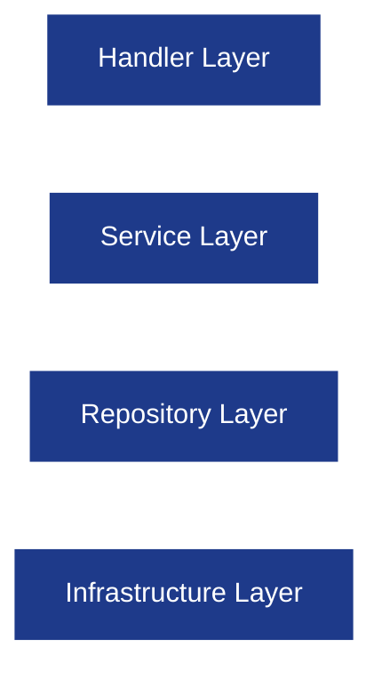
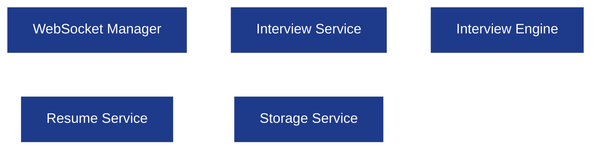

# ADR-005 — Dependency Direction and Layering Rules

**Project:** AI Interview Service

**Status:** Accepted

**Date:** 2026-08-23

---

# Context

AI Interview Service is designed as a modular Go backend with multiple business domains (`auth`, `resume`, `interview`, `websocket`, `storage`, `user`).

Without clear dependency rules, business modules can begin importing each other directly, creating circular dependencies, tightly coupled services, and code that becomes difficult to test or maintain.

This ADR defines the allowed dependency direction for the entire backend.

---

# Decision

The backend follows a **strict layered dependency architecture**.



Dependencies always flow **downward**.

No lower layer is allowed to import a higher layer.

---

# Layer Responsibilities

| Layer              | Responsibility                                                     |
| ------------------ | ------------------------------------------------------------------ |
| **Handler**        | HTTP/WebSocket request handling, DTO binding, response formatting. |
| **Service**        | Business logic and orchestration.                                  |
| **Repository**     | PostgreSQL, Redis, and storage operations.                         |
| **Infrastructure** | External systems such as PostgreSQL, Redis, S3/R2, and Gemini.     |

---

# Module Interaction Rules

Business modules communicate through **services**, never through repositories.

### Allowed Flow



---

# Import Rules

## Allowed Imports

| From             | Can Import                                     |
| ---------------- | ---------------------------------------------- |
| Handler          | Service, DTO, Shared                           |
| Service          | Repository, Shared, Storage, Interview Engine  |
| Repository       | Models, Shared, Database Client                |
| Interview Engine | LangGraph, LangChain Provider, Schemas, Memory |

## Forbidden Imports

| Forbidden Dependency              | Reason                                                    |
| --------------------------------- | --------------------------------------------------------- |
| Handler → Repository              | Bypasses business logic.                                  |
| Repository → Service              | Creates circular dependency.                              |
| Repository → Handler              | Infrastructure should not know HTTP.                      |
| Shared → Business Modules         | Shared package must remain generic.                       |
| Interview Engine → Auth/WebSocket | Engine should remain transport-agnostic.                  |
| Resume → WebSocket                | Resume pipeline is independent of realtime communication. |

---

# Interface Ownership Rule

Interfaces are owned by the **consumer**, not the implementation.

Example:

```go
type ResumeRepository interface {
    Create(ctx context.Context, resume Resume) error
    FindByID(ctx context.Context, id uuid.UUID) (*Resume, error)
}
```

The service depends on the interface, while the repository provides the implementation.

### Why?

* Easier mocking.
* Better dependency inversion.
* Cleaner unit tests.
* Repository implementations can change without affecting services.

---

# Why the Interview Engine Is Isolated

The Interview Engine is treated as a business capability, not an infrastructure service.

It receives structured interview context and returns structured interview actions.

It does **not** know:

* HTTP requests.
* JWT authentication.
* WebSocket connections.
* PostgreSQL queries.
* Redis implementation details.

This keeps AI orchestration independent from transport and persistence layers.

---

# Alternatives Considered

## Option 1 — Global `repository/` and `service/` packages

Rejected because business logic becomes spread across unrelated packages and ownership becomes unclear.

## Option 2 — Feature packages importing each other's repositories

Rejected because it creates tight coupling and circular imports.

## Option 3 — Domain-first architecture (Selected)

Each business domain owns its handler, service, repository, DTO, model, validation, and errors.

This provides clear ownership boundaries and scales better.

---

# Consequences

### Benefits

* Clear dependency direction.
* No circular imports.
* Easier testing with mocks.
* Independent business modules.
* Predictable project organization.

### Trade-offs

* Slightly more interfaces.
* More files per business domain.
* Requires discipline when adding new packages.

These trade-offs are acceptable for a production backend.

---

# Status

**Accepted** — This ADR is mandatory for all backend modules in Version 1 of AI Interview Service.
