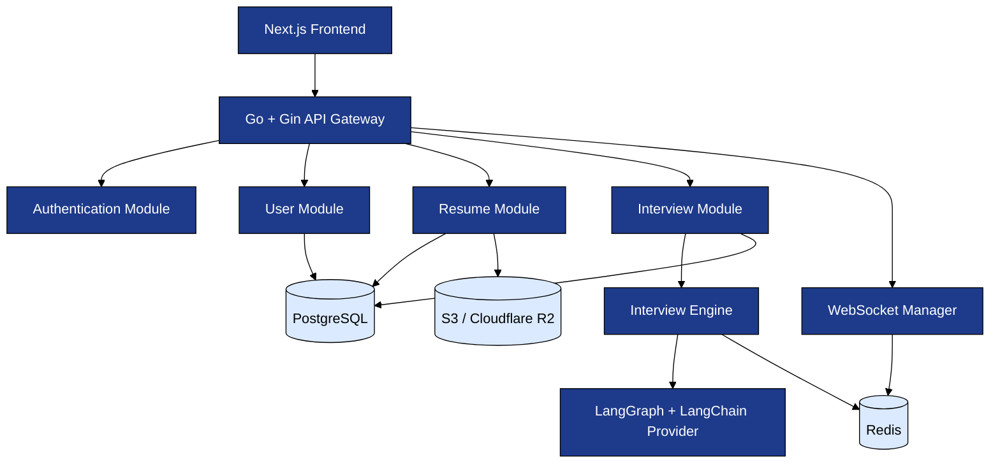
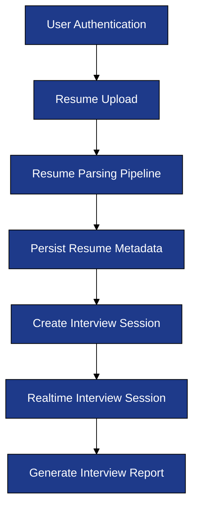
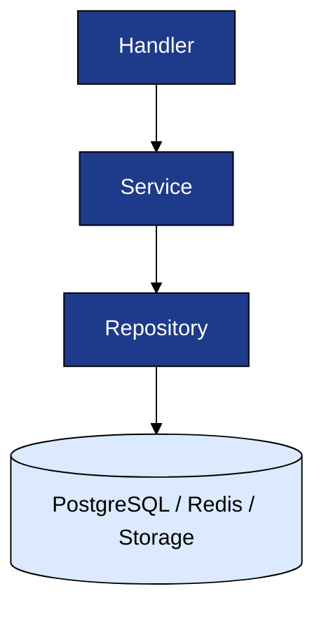

# Backend Technical Specification Overview

**Project:** AI Interview Service

**Document:** `docs/tech-spec/00_OVERVIEW.md`

**Version:** 1.0 (V1 Architecture)

**Status:** Locked

---

# 1. Purpose

This directory contains the complete backend architecture and technical design for **AI Interview Service**.

The objective of these specifications is to design every major backend subsystem before implementation so that the application follows a consistent, scalable, and production-ready architecture.

These documents describe **how the backend is designed**, not how individual APIs or functions are implemented.

The backend is built with a **backend-first approach**, where every module has a clearly defined responsibility, ownership boundary, and interaction pattern.

---

# 2. Documentation Structure

The backend specification is intentionally divided into focused documents. Each document owns exactly one subsystem of the backend architecture.

```text
docs/
├── PRODUCT_SCOPE.md
│
├── tech-spec/
│   ├── 00_OVERVIEW.md
│   ├── 01_TECH_STACK.md
│   ├── 02_SYSTEM_ARCHITECTURE.md
│   ├── 03_FOLDER_STRUCTURE.md
│   ├── 04_INTERVIEW_ENGINE.md
│   ├── 05_RESUME_PIPELINE.md
│   ├── 06_DATABASE_SCHEMA.md
│   ├── 07_REDIS_STRATEGY.md
│   ├── 08_API_SPEC.md
│   ├── 09_WEBSOCKET_PROTOCOL.md
│   ├── 10_AUTH_SECURITY.md
│   ├── 11_PROMPT_ARCHITECTURE.md
│   ├── 12_EVALUATION_ENGINE.md
│   ├── 13_DEPLOYMENT.md
│   └── 14_NON_FUNCTIONAL_REQUIREMENTS.md
│
└── decisions/
    ├── ADR-001-go-gin.md
    ├── ADR-002-langgraph-langchain.md
    ├── ADR-003-resume-storage.md
    └── ADR-004-database-strategy.md
```

Each technical specification can be read independently while following the overall architecture defined in this document.

---

# 3. Reading Order

The documents should be read in the following order.

| Step   | Document                            | Purpose                                                              |
| ------ | ----------------------------------- | -------------------------------------------------------------------- |
| **1**  | `00_OVERVIEW.md`                    | Overall backend architecture and documentation conventions.          |
| **2**  | `01_TECH_STACK.md`                  | Technology choices and architecture decisions.                       |
| **3**  | `02_SYSTEM_ARCHITECTURE.md`         | High-Level Design and backend request lifecycle.                     |
| **4**  | `03_FOLDER_STRUCTURE.md`            | Production Go project organization.                                  |
| **5**  | `04_INTERVIEW_ENGINE.md`            | LangGraph orchestration, memory model, evaluation flow.              |
| **6**  | `05_RESUME_PIPELINE.md`             | Resume upload, parsing, validation, and storage pipeline.            |
| **7**  | `06_DATABASE_SCHEMA.md`             | PostgreSQL entities and relationships.                               |
| **8**  | `07_REDIS_STRATEGY.md`              | Redis responsibilities and caching strategy.                         |
| **9**  | `08_API_SPEC.md`                    | REST API contracts.                                                  |
| **10** | `09_WEBSOCKET_PROTOCOL.md`          | Realtime interview communication protocol.                           |
| **11** | `10_AUTH_SECURITY.md`               | Authentication, authorization, and backend guardrails.               |
| **12** | `11_PROMPT_ARCHITECTURE.md`         | Prompt versioning, structured outputs, and LLM interaction strategy. |
| **13** | `12_EVALUATION_ENGINE.md`           | Candidate evaluation and report generation.                          |
| **14** | `13_DEPLOYMENT.md`                  | Docker, infrastructure, environments, and deployment strategy.       |
| **15** | `14_NON_FUNCTIONAL_REQUIREMENTS.md` | Reliability, scalability, latency, and production requirements.      |

---

# 4. Documentation Standards

Every technical specification in this repository follows the same documentation standards.

## 4.1 Mermaid-Only Diagrams

All architecture diagrams must be written using **Mermaid**.

* No screenshots.
* No Draw.io exports.
* No SVG or image-based architecture diagrams.

This keeps diagrams version-controlled and editable inside Git.

---

## 4.2 Mermaid Theme

Every Mermaid diagram in the repository must begin with the following initialization block.

```markdown
%%{init: {
  "theme":"base",
  "themeVariables":{
    "primaryColor":"#1E3A8A",
    "primaryTextColor":"#FFFFFF",
    "primaryBorderColor":"#000000",
    "lineColor":"#000000",
    "secondaryColor":"#2563EB",
    "secondaryTextColor":"#FFFFFF",
    "tertiaryColor":"#DBEAFE",
    "fontFamily":"Inter"
  }
}}%%
```

### Diagram Style Rules

| Element           | Standard                          |
| ----------------- | --------------------------------- |
| Service / Module  | Dark Blue Background              |
| Text              | White                             |
| Border            | Black                             |
| Arrow             | Black                             |
| Database          | Light Blue Fill with Black Border |
| External Services | Dashed Border when appropriate    |

---

## 4.3 One Responsibility Per Diagram

Each diagram should explain **one backend concept**.

Examples:

* Resume Upload Flow.
* Resume Parsing Pipeline.
* Authentication Flow.
* Interview Engine State Flow.
* WebSocket Lifecycle.

Avoid combining multiple systems into one large diagram.

---

## 4.4 One Responsibility Per Document

Every technical specification owns one backend subsystem.

Examples:

| Document                 | Owns                                                          |
| ------------------------ | ------------------------------------------------------------- |
| `05_RESUME_PIPELINE.md`  | Resume upload, extraction, parsing, validation, storage.      |
| `04_INTERVIEW_ENGINE.md` | LangGraph orchestration and interview intelligence.           |
| `10_AUTH_SECURITY.md`    | Authentication, authorization, guardrails, and rate limiting. |

---

## 4.5 Architecture Decision Records (ADR)

Important architecture decisions are documented separately under `docs/decisions/`.

Every ADR contains:

* Context.
* Decision.
* Alternatives Considered.
* Consequences.

This preserves the reasoning behind major architectural choices.

---

# 5. Backend Architecture Overview

The backend is organized into independent business domains connected through a single Go application.



---

## Architecture Summary

The backend consists of three major layers.

| Layer                    | Responsibility                                                                  |
| ------------------------ | ------------------------------------------------------------------------------- |
| **API Layer**            | Handles HTTP and WebSocket requests, authentication, validation, and routing.   |
| **Domain Layer**         | Contains business logic for users, resumes, interviews, and session management. |
| **Infrastructure Layer** | PostgreSQL, Redis, object storage, and external LLM provider integration.       |

The **Interview Engine** is the only component responsible for AI orchestration.

---

# 6. Backend Module Responsibilities

The backend is organized around business domains instead of technical layers.

| Module         | Responsibility                                                                                          |
| -------------- | ------------------------------------------------------------------------------------------------------- |
| **auth**       | Authentication, JWT validation, refresh tokens, authorization.                                          |
| **user**       | User account and profile management.                                                                    |
| **resume**     | Resume upload, validation, parsing orchestration, metadata persistence, and storage integration.        |
| **interview**  | Interview lifecycle, conversation persistence, session orchestration, and Interview Engine integration. |
| **websocket**  | Realtime interview communication and connection lifecycle.                                              |
| **storage**    | Object storage abstraction for uploaded resumes.                                                        |
| **middleware** | Shared authentication, logging, validation, CORS, and rate-limiting middleware.                         |
| **shared**     | Common utilities, constants, errors, helpers, and reusable infrastructure components.                   |

Each module owns its own handlers, services, repositories, DTOs, and models.

---

# 7. Backend Request Lifecycle

Every interview follows the same backend lifecycle from authentication to report generation.



Every stage is owned by a dedicated backend subsystem and documented separately.

---

# 8. Layering Convention

The backend follows a strict layered architecture inside every business domain.



### Layer Responsibilities

| Layer          | Responsibility                                                        |
| -------------- | --------------------------------------------------------------------- |
| **Handler**    | Receives HTTP/WebSocket requests, validates input, returns responses. |
| **Service**    | Business logic and orchestration.                                     |
| **Repository** | Database and storage operations.                                      |
| **Model**      | Persistent database entities.                                         |
| **DTO**        | Request and response contracts between API and clients.               |

### Layer Rules

* Handlers must not access databases directly.
* Services must not know HTTP request or response objects.
* Repositories contain persistence logic only.
* DTOs must never expose internal database models.

---

# 9. Core Design Principles

The backend follows these architectural principles throughout the project.

## Domain-Oriented Architecture

Business capabilities are isolated into independent modules.

## Single Responsibility

Every module owns one responsibility and one ownership boundary.

## AI is Isolated Behind the Interview Engine

The LLM is an implementation detail of the Interview Engine.

No other backend module communicates directly with LangGraph, LangChain, or the LLM provider.

## Stateless APIs

REST APIs remain stateless.

Only active interview sessions maintain temporary state through Redis.

## PostgreSQL is the Source of Truth

Redis stores temporary session state and caches.

Permanent application data is always stored in PostgreSQL.

---

# 10. Technology Summary

| Layer                  | Technology                |
| ---------------------- | ------------------------- |
| Programming Language   | Go                        |
| HTTP Framework         | Gin                       |
| Database               | PostgreSQL                |
| Cache / Session Store  | Redis                     |
| AI Workflow            | LangGraph                 |
| LLM Abstraction        | LangChain                 |
| Initial LLM Provider   | Gemini                    |
| Realtime Communication | WebSockets                |
| Object Storage         | Amazon S3 / Cloudflare R2 |
| Containerization       | Docker                    |

Detailed reasoning for every technology is documented in `01_TECH_STACK.md`.

---

# 11. Scope of V1 Backend

The backend architecture is intentionally scoped for Version 1.

### Included

* Resume-based SDE interviews.
* Resume upload and parsing.
* Dynamic AI interview orchestration.
* Realtime interview sessions.
* Interview persistence.
* Evaluation and report generation.

### Explicitly Excluded

* Job Description personalization.
* Live coding environment.
* Video interviews.
* Multi-company interviewer personalities.
* Subscription and billing.
* Vector database and semantic retrieval.
* Background job queue.

These features may be introduced in future architecture revisions.

---

# 12. Open Questions

The following topics are intentionally deferred to dedicated technical specifications.

| Topic                                  | Document                 |
| -------------------------------------- | ------------------------ |
| Resume parsing strategy and validation | `05_RESUME_PIPELINE.md`  |
| Candidate memory model                 | `04_INTERVIEW_ENGINE.md` |
| PostgreSQL schema design               | `06_DATABASE_SCHEMA.md`  |
| Redis session lifecycle                | `07_REDIS_STRATEGY.md`   |
| Prompt guardrails and prompt injection | `10_AUTH_SECURITY.md`    |
| Deployment and observability           | `13_DEPLOYMENT.md`       |

---

# 13. Revision History

| Version  | Changes                                                                                        |
| -------- | ---------------------------------------------------------------------------------------------- |
| **1.0**  | Initial backend architecture overview for V1.                                                  |
| **1.1+** | Future revisions will update this document only when the overall backend architecture changes. |
