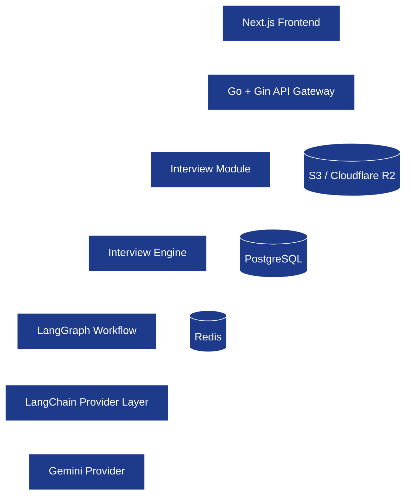
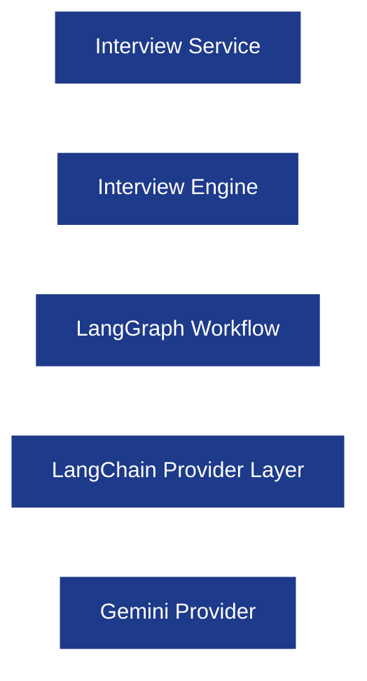

# Technology Stack

**Project:** AI Interview Service

**Document:** `docs/tech-spec/01_TECH_STACK.md`

**Version:** 1.0 (V1 Architecture)

**Status:** Locked

---

# 1. Purpose

This document defines the complete backend technology stack for **AI Interview Service** and explains why each technology has been selected.

The goal is to make every technology decision explicit before implementation so the backend remains scalable, maintainable, secure, and production-ready.

This document covers:

* Core backend technologies.
* AI orchestration technologies.
* Infrastructure technologies.
* Development tooling.
* Architecture decisions behind each technology.

Implementation details for individual subsystems are documented in their respective technical specifications.

---

# 2. Technology Selection Principles

Every technology included in this project must satisfy the following engineering principles.

## 2.1 Production First

Every technology should be suitable for production deployment with real users.

Requirements include:

* Reliability.
* Scalability.
* Observability.
* Maintainability.
* Security.

---

## 2.2 Simplicity Before Complexity

Choose the simplest architecture that satisfies V1 requirements.

Avoid adding infrastructure unless it solves a real backend problem.

Examples:

* No vector database in V1.
* No message queue in V1.
* No microservices in V1.

---

## 2.3 Clear Responsibility

Each technology owns one responsibility.

Avoid overlapping tools solving the same problem.

---

## 2.4 Strong Ecosystem

Prefer technologies with:

* Long-term maintenance.
* Strong community adoption.
* Stable APIs.
* Production usage.

---

## 2.5 Security by Default

Every technology decision must support:

* Authentication.
* Authorization.
* Secure storage.
* Secret management.
* Input validation.
* Protection against common backend attacks.

---

# 3. Technology Stack Overview

| Layer                  | Technology                |
| ---------------------- | ------------------------- |
| Programming Language   | Go                        |
| HTTP Framework         | Gin                       |
| ORM                    | GORM                      |
| Database               | PostgreSQL                |
| Cache & Session Store  | Redis                     |
| Object Storage         | Amazon S3 / Cloudflare R2 |
| AI Workflow Engine     | LangGraph                 |
| LLM Abstraction        | LangChain                 |
| Initial LLM Provider   | Gemini                    |
| Realtime Communication | WebSockets                |
| Database Migrations    | golang-migrate            |
| Configuration          | Viper                     |
| Validation             | go-playground/validator   |
| Logging                | slog                      |
| Containerization       | Docker                    |

---

# 4. High-Level Technology Architecture

---

# 5. Core Backend Stack

## 5.1 Programming Language — Go

### Why Go?

Go is selected because the backend needs to handle:

* Concurrent interview sessions.
* WebSocket connections.
* PostgreSQL operations.
* Redis interactions.
* External LLM requests.

### Responsibilities

* HTTP APIs.
* WebSocket server.
* Authentication.
* Resume pipeline orchestration.
* Session lifecycle.
* Database operations.
* Storage integration.

### Best Practices

* Use Go modules.
* Keep business domains under `internal/`.
* Use interfaces between services and repositories.

---

## 5.2 HTTP Framework — Gin

Gin is responsible only for HTTP and WebSocket request handling.

### Responsibilities

* Routing.
* Middleware execution.
* Request binding.
* DTO validation.
* Response serialization.
* WebSocket upgrade.

### Not Responsible For

* Business logic.
* Database queries.
* AI orchestration.

---

## 5.3 ORM — GORM

GORM is selected for V1 because it balances development speed and maintainability.

### Responsibilities

* PostgreSQL models.
* Relationships.
* CRUD operations.
* Transactions.
* Query building.

### Best Practices

* Keep GORM inside repositories.
* Never expose GORM models directly through APIs.
* Use DTOs for API responses.

---

## 5.4 Database Migrations — golang-migrate

All schema changes must be version-controlled.

### Why?

* Reproducible deployments.
* Rollback support.
* Production-safe schema evolution.

---

## 5.5 Configuration — Viper

Configuration is environment-driven.

### Responsibilities

* Environment loading.
* Validation.
* Defaults.
* Configuration hierarchy.

### Secrets

Never store secrets inside source code.

Use environment variables.

---

## 5.6 Validation — go-playground/validator

Validation happens at the handler layer.

### Responsibilities

* Required fields.
* Length validation.
* Email validation.
* UUID validation.
* Enum validation.

Business validation remains inside services.

---

## 5.7 Logging — slog

Structured logging is mandatory.

### Logging Format

JSON logs with contextual fields.

Example fields:

* request_id
* user_id
* session_id
* resume_id
* interview_id

Sensitive information must never be logged.

---

# 6. AI Stack

The AI stack is isolated inside the **Interview Engine**.

## AI Architecture

---

## 6.1 LangGraph

LangGraph orchestrates the interview workflow.

### Responsibilities

* Conversation state.
* Topic transitions.
* Follow-up routing.
* Difficulty adaptation.
* Interview completion flow.

### LangGraph Does NOT Handle

* Authentication.
* Database persistence.
* Resume storage.
* Session management.

---

## 6.2 LangChain

LangChain is used only as the LLM abstraction layer.

### Responsibilities

* Provider abstraction.
* Prompt execution.
* Streaming responses.
* Structured JSON output.

### Why LangChain?

Benefits:

* Easy provider switching.
* Unified API.
* Streaming support.
* Structured output support.

### What We Will NOT Use

| Feature          | Decision                           |
| ---------------- | ---------------------------------- |
| Memory           | Backend owns memory.               |
| Agents           | LangGraph owns interview workflow. |
| Retrieval        | Not required in V1.                |
| Global callbacks | Backend owns logging and metrics.  |

---

## 6.3 Gemini

Gemini is the initial LLM provider.

### Responsibilities

* Resume parsing.
* Question generation.
* Answer evaluation.
* Interview feedback.

The provider must remain replaceable.

---

## 6.4 Provider Abstraction

The Interview Engine communicates through a provider interface rather than directly with Gemini.

### Benefits

* Provider independence.
* Easier testing.
* Future provider support.

Supported future providers:

* OpenAI.
* Anthropic.
* Azure OpenAI.

---

# 7. Database Stack

## 7.1 PostgreSQL

PostgreSQL is the **single source of truth**.

### Stores

* Users.
* Resume metadata.
* Parsed resume JSON.
* Interview sessions.
* Conversation history.
* Evaluation reports.

### Why PostgreSQL?

* ACID transactions.
* Relational modeling.
* JSONB support.
* Strong indexing.

---

## 7.2 Database Philosophy

Core entities are normalized.

Examples include:

* users
* resumes
* resume_projects
* interview_sessions
* interview_messages
* evaluations

Flexible AI outputs use JSONB.

---

# 8. Redis Stack

Redis stores temporary application state.

## Responsibilities

| Responsibility            | Purpose                   |
| ------------------------- | ------------------------- |
| Active Interview Sessions | Fast session lookup.      |
| WebSocket Session State   | Reconnect support.        |
| Conversation Cache        | Avoid repeated DB reads.  |
| Rate Limiting             | Sliding window counters.  |
| Temporary Caching         | Performance optimization. |

### Redis is NOT the source of truth.

If Redis is unavailable, interview history remains available in PostgreSQL.

---

# 9. Resume Storage Stack

Resume PDFs are stored in object storage.

## Storage Architecture

| Data               | Storage Location   |
| ------------------ | ------------------ |
| Resume PDF         | S3 / Cloudflare R2 |
| Resume Metadata    | PostgreSQL         |
| Parsed Resume JSON | PostgreSQL         |

### Why Store the Original PDF?

* Re-parsing after parser improvements.
* Debugging parsing failures.
* Future resume analysis features.
* User download/history.

The Interview Engine never reads the PDF during interviews.

---

# 10. Realtime Communication Stack

WebSockets provide realtime interview communication.

## Responsibilities

* Stream candidate answers.
* Stream interviewer responses.
* Maintain interview session.
* Resume disconnected sessions.

### REST APIs

REST APIs are used for:

* Authentication.
* Resume upload.
* Interview creation.
* Fetching reports.

---

## 10.1 Frontend Speech Stack

The interview platform supports **voice-first interviews** using browser-native speech capabilities. Speech processing is intentionally kept on the frontend to minimize backend complexity, reduce latency, and eliminate infrastructure costs in V1.

### Technology Choice

| Responsibility       | Technology                               | Reason                                                                |
| -------------------- | ---------------------------------------- | --------------------------------------------------------------------- |
| Speech-to-Text (STT) | **Web Speech API (`SpeechRecognition`)** | Free browser-native speech recognition with real-time transcription.  |
| Text-to-Speech (TTS) | **Web Speech API (`speechSynthesis`)**   | Free browser-native speech synthesis for interviewer voice responses. |

### Speech Architecture

```mermaid
%%{init: {
  "theme":"base",
  "themeVariables":{
    "background":"#0F172A",
    "primaryColor":"#1E3A8A",
    "primaryTextColor":"#FFFFFF",
    "primaryBorderColor":"#FFFFFF",
    "lineColor":"#FFFFFF",
    "secondaryColor":"#2563EB",
    "secondaryTextColor":"#FFFFFF",
    "tertiaryColor":"#1E293B",
    "fontFamily":"Inter",
    "edgeLabelBackground":"#0F172A"
  }
}}%%

flowchart LR

    USER["Candidate"]

    SPEECH["Web Speech API"]

    WS["WebSocket Manager"]

    INTERVIEW["Interview Service"]

    USER -->|Voice| SPEECH
    SPEECH -->|Transcribed Text| WS
    WS --> INTERVIEW

    INTERVIEW -->|Interviewer Text| WS
    WS --> SPEECH
    SPEECH -->|Synthesized Voice| USER
```

### Backend Responsibilities

The backend never receives raw audio.

* Receives **transcribed text** from the frontend over WebSocket.
* Sends **text responses** generated by the Interview Engine.
* Remains independent of speech recognition and speech synthesis providers.

### Why This Design?

* No audio streaming infrastructure is required.
* No speech-processing cost for V1.
* Lower latency because speech recognition runs locally in the browser.
* Keeps the backend focused on interview orchestration instead of audio processing.

### V1 Limitation

The Web Speech API depends on browser support and microphone permissions. Chrome and Chromium-based browsers provide the best support for both speech recognition and speech synthesis.

# 11. Containerization Stack

Docker is used for development and deployment consistency.

### Services

* Backend.
* PostgreSQL.
* Redis.

### Benefits

* Reproducible environments.
* Easy onboarding.
* Production parity.

Object storage and Gemini remain external services.

---

# 12. Development & Testing Stack

| Responsibility        | Tool               |
| --------------------- | ------------------ |
| Unit Testing          | Go testing package |
| Mocking               | Testify            |
| Assertions            | Testify            |
| API Testing           | Postman / Bruno    |
| Linting               | golangci-lint      |
| Formatting            | gofmt              |
| Dependency Management | Go Modules         |

### Best Practices

* Unit tests for services.
* Repository tests with PostgreSQL test database.
* Mock LLM provider during Interview Engine tests.

---

# 13. Architecture Decisions (Locked)

## AD-001 — Go is the Backend Language

Go is selected for concurrency, performance, and backend ecosystem maturity.

---

## AD-002 — Gin is the HTTP Framework

Gin owns routing and middleware only.

Business logic remains outside handlers.

---

## AD-003 — GORM is Used for V1

GORM improves development speed while repositories isolate ORM usage.

---

## AD-004 — PostgreSQL is the Source of Truth

Permanent application data always lives inside PostgreSQL.

---

## AD-005 — Redis Stores Temporary State

Redis stores only cache, session state, and rate limiting information.

---

## AD-006 — LangGraph Owns Interview Workflow

LangGraph manages conversation flow and interview orchestration.

---

## AD-007 — LangChain Owns LLM Abstraction

LangChain provides provider abstraction, streaming, and structured output.

No LangChain memory or agents are used.

---

## AD-008 — Resume PDFs are Stored Separately

Resume PDFs live in object storage.

Parsed JSON becomes the interview-ready representation stored in PostgreSQL.

---

# 14. Best Practices

* Thin handlers.
* Rich services.
* Repository-only database access.
* Provider abstraction for LLMs.
* Structured JSON logging.
* Environment-driven configuration.
* Validate every LLM response against a schema before processing.

---

# 15. Future Scope

The following technologies are intentionally excluded from V1.

| Technology             | Reason                                            |
| ---------------------- | ------------------------------------------------- |
| Vector Database        | Semantic retrieval is unnecessary for V1 resumes. |
| Redis Streams          | Background jobs are not required initially.       |
| Kafka                  | No asynchronous event pipeline in V1.             |
| OpenTelemetry          | Added after production deployment.                |
| Prometheus + Grafana   | Added with production monitoring.                 |
| Multi-provider routing | Added after supporting multiple LLM providers.    |

---

# Revision History

| Version | Changes                                                          |
| ------- | ---------------------------------------------------------------- |
| **1.0** | Initial production technology stack for AI Interview Service V1. |
