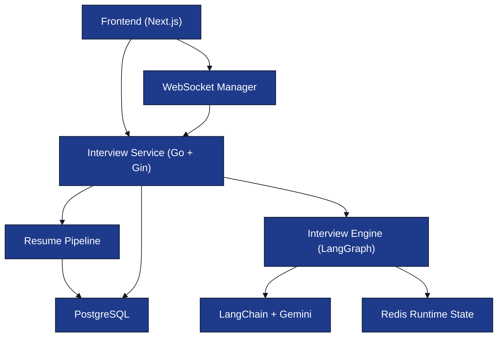
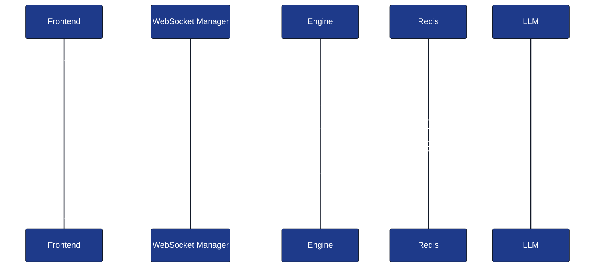

```mermaid
%%{init:{
  "theme":"base",
  "themeVariables":{
    "background":"#FFFFFF",
    "primaryColor":"#1E3A8A",
    "primaryTextColor":"#FFFFFF",
    "primaryBorderColor":"#111827",
    "secondaryColor":"#2563EB",
    "secondaryTextColor":"#FFFFFF",
    "tertiaryColor":"#DBEAFE",
    "lineColor":"#111827",
    "edgeLabelBackground":"#FFFFFF",
    "fontFamily":"Inter"
  }
}}%%

flowchart LR

    PDF["Resume PDF"]

    EXTRACT["Extract & Normalize Text"]

    PARSER["LLM Resume Parser"]

    BUILDER["Resume Intelligence Builder"]

    STORE["PostgreSQL"]

    PDF --> EXTRACT
    EXTRACT --> PARSER
    PARSER --> BUILDER
    BUILDER --> STORE
```

# System Architecture (HLD)

**Project:** AI Interview Service

**Document:** `docs/tech-spec/02_architecture.md`

**Version:** 1.0 (LOCKED)

---

# Ownership

**This document owns:**

- High-Level Architecture (HLD)
- Service boundaries
- Backend communication flow
- Runtime component responsibilities

**References:**

- `01_tech_stack.md` → Technology choices.
- `03_folder_structure.md` → Package organization.
- `04_interview_engine.md` → Interview workflow.
- `05_resume_pipeline.md` → Resume processing internals.
- `08_redis_strategy.md` → Redis runtime state.

---

# 1. High-Level Architecture

---

# 2. Component Responsibilities

| Component | Responsibility |
|-----------|----------------|
| **Frontend (Next.js)** | Resume upload, interview UI, speech input/output, WebSocket connection. |
| **Interview Service** | REST APIs, authentication, session management, and request routing. |
| **Resume Pipeline** | Convert uploaded resume into structured interview intelligence. |
| **Interview Engine** | Execute LangGraph workflow and manage interview state. |
| **LangChain + Gemini** | Execute prompts and return structured JSON responses. |
| **PostgreSQL** | Persistent application data. |
| **Redis** | Runtime interview state and caching. |

---

# 3. Runtime Data Ownership

| Storage | Owns |
|---------|------|
| **PostgreSQL** | Users, resumes, interview sessions, evaluations, interview metadata. |
| **Redis** | Current topic, covered topics, candidate memory, interview timers, active session state. |

> PostgreSQL is the **source of truth**. Redis stores temporary runtime state only.

---

# 4. Backend Request Lifecycle

This sequence represents the complete backend flow before the interview begins.

---

# 5. Real-Time Interview Flow

Speech is converted into text on the frontend using the Web Speech API before reaching the backend.

---

# 6. Resume Processing Flow

Detailed processing logic is defined in **`05_resume_pipeline.md`**.

---

# 7. Service Boundaries

| Module | Responsibility |
|--------|----------------|
| **Interview Service** | Entry point for REST APIs and WebSocket connections. |
| **Resume Pipeline** | Executes resume parsing once before interview creation. |
| **Interview Engine** | Manages LangGraph workflow and interview progression. |
| **WebSocket Manager** | Maintains client connections and message routing. |
| **Storage Layer** | PostgreSQL and Redis access. |

Each module owns a single responsibility and communicates through service interfaces.

---

# 8. External Integrations

| Integration | Purpose |
|-------------|---------|
| **Gemini** | LLM reasoning and structured generation. |
| **LangChain** | Prompt execution and structured output parsing. |
| **Web Speech API** | Speech-to-text and text-to-speech in the browser. |

No external integration communicates directly with PostgreSQL or Redis.

---

# 9. Architecture Principles

- Stateless REST APIs.
- Stateful interview sessions managed through Redis.
- PostgreSQL is the persistent source of truth.
- LangGraph controls interview orchestration.
- LangChain abstracts the LLM provider.
- Resume parsing happens once before interview initialization.

---

# 10. Related Documents

| Topic | Document |
|-------|----------|
| Folder Structure | `03_folder_structure.md` |
| Interview Workflow | `04_interview_engine.md` |
| Resume Pipeline | `05_resume_pipeline.md` |
| Prompt Architecture | `06_prompt_architecture.md` |
| Database Schema | `07_database_schema.md` |
| Redis Strategy | `08_redis_strategy.md` |
| WebSocket Protocol | `09_websocket_protocol.md` |