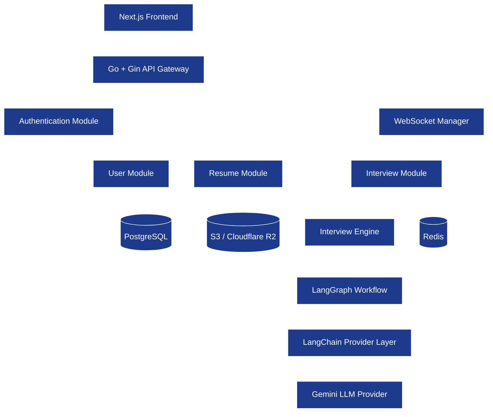
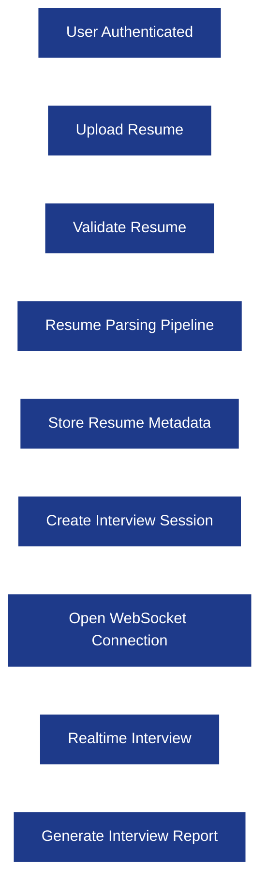
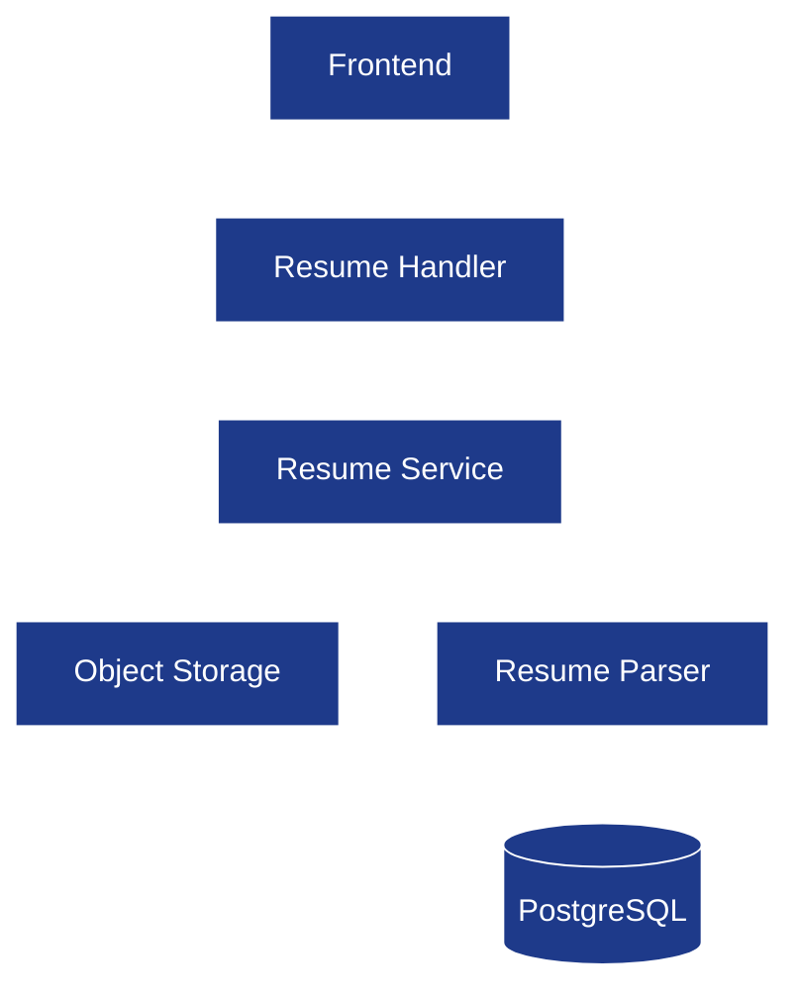
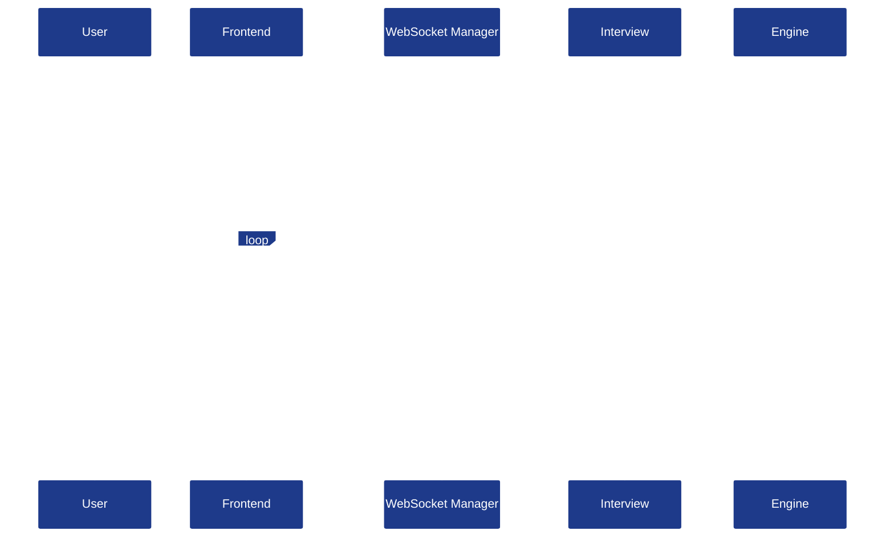
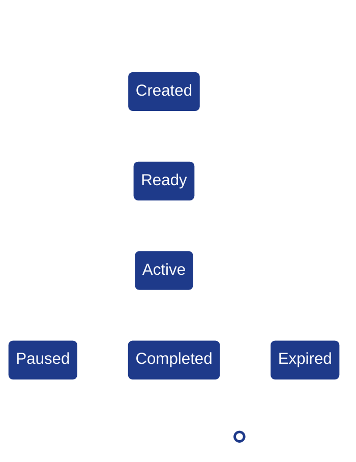
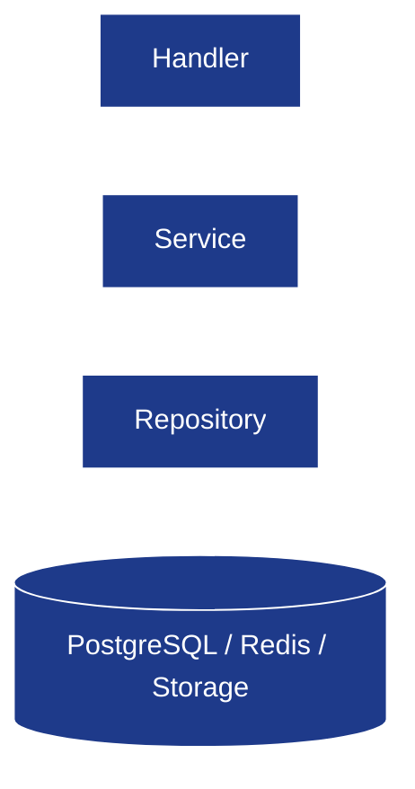

# System Architecture

**Project:** AI Interview Service

**Document:** `docs/tech-spec/02_SYSTEM_ARCHITECTURE.md`

**Version:** 1.0 (V1 Architecture)

**Status:** Locked

---

# 1. Purpose

This document defines the **High-Level Design (HLD)** of the backend.

It explains how every backend subsystem communicates, how requests flow through the application, and where each responsibility belongs.

This document does **not** describe database tables, API payloads, or LangGraph internals. Those are documented separately.

---

# 2. System Architecture Goals

The backend architecture is designed with the following goals:

* Modular business domains.
* Clear ownership boundaries.
* Stateless REST APIs.
* Realtime interview sessions using WebSockets.
* AI isolated behind the Interview Engine.
* PostgreSQL as the source of truth.
* Redis for temporary state and caching.
* Object storage for resume files.

---

# 3. High-Level Architecture

---

## Architecture Summary

The backend consists of **three logical layers**.

| Layer                | Responsibility                                                |
| -------------------- | ------------------------------------------------------------- |
| API Layer            | HTTP APIs, WebSocket upgrades, authentication, validation.    |
| Domain Layer         | Business logic for users, resumes, interviews, and sessions.  |
| Infrastructure Layer | PostgreSQL, Redis, object storage, and external LLM provider. |

The Interview Engine is the only subsystem allowed to communicate with the LLM.

---

# 4. Component Responsibilities

## 4.1 API Gateway

The API Gateway is the entry point for every request coming from the frontend.

### Responsibilities

* Route HTTP requests.
* Authenticate requests.
* Validate DTOs.
* Register WebSocket connections.
* Forward requests to services.

### Does Not Own

* Business logic.
* Database operations.
* AI orchestration.

---

## 4.2 Authentication Module

Owns user authentication and authorization.

### Responsibilities

* Login.
* Signup.
* JWT verification.
* Refresh tokens.
* Route protection.

---

## 4.3 User Module

Owns user profile information.

### Responsibilities

* User profile.
* Resume ownership.
* Interview ownership.
* Account preferences.

---

## 4.4 Resume Module

Owns the complete resume lifecycle.

### Responsibilities

* Resume upload.
* File validation.
* PDF extraction.
* Resume parsing orchestration.
* Metadata persistence.

### Output

A structured resume JSON ready for interviews.

---

## 4.5 Interview Module

Owns interview session management.

### Responsibilities

* Create interview sessions.
* Store conversation history.
* Persist interview state.
* Connect Interview Engine.
* Generate reports.

---

## 4.6 WebSocket Manager

Owns realtime communication.

### Responsibilities

* Upgrade HTTP → WebSocket.
* Authenticate socket.
* Track active connections.
* Handle reconnects.
* Stream interviewer responses.

---

## 4.7 Interview Engine

Owns all AI interview intelligence.

### Responsibilities

* Dynamic conversation flow.
* Candidate memory.
* Topic transitions.
* Question generation.
* Answer evaluation.
* Feedback generation.

The Interview Engine does not know anything about HTTP or PostgreSQL.

---

# 5. Backend Request Lifecycle

This section shows how a complete interview flows through the backend.

---

## Request Lifecycle Summary

| Step                 | Owner                               |
| -------------------- | ----------------------------------- |
| Authentication       | Auth Module                         |
| Resume Upload        | Resume Module                       |
| Resume Validation    | Resume Module                       |
| Resume Parsing       | Resume Module                       |
| Session Creation     | Interview Module                    |
| WebSocket Connection | WebSocket Manager                   |
| AI Conversation      | Interview Engine                    |
| Report Generation    | Interview Module + Interview Engine |

---

# 6. Resume Upload Architecture

Resume upload is a synchronous backend workflow in V1.

### Pipeline Responsibilities

| Component  | Responsibility                    |
| ---------- | --------------------------------- |
| Handler    | Validate upload request.          |
| Service    | Coordinate upload and parsing.    |
| Storage    | Store original PDF.               |
| Parser     | Produce structured resume JSON.   |
| PostgreSQL | Store metadata and parsed output. |

---

# 7. Realtime Interview Architecture

Realtime interviews use WebSockets after the session is created.

---

## Why WebSockets?

| Requirement                 | Why WebSockets                               |
| --------------------------- | -------------------------------------------- |
| Bidirectional communication | Candidate and interviewer talk continuously. |
| Streaming responses         | AI responses arrive progressively.           |
| Low latency                 | No repeated polling.                         |
| Reconnect support           | Resume interrupted interviews.               |

REST APIs are used only before and after the interview.

---

# 8. Interview Session Lifecycle

Every interview session has a lifecycle managed by the Interview Module.

### Session States

| State     | Description                                |
| --------- | ------------------------------------------ |
| Created   | Session created but interview not started. |
| Ready     | Resume parsed and session initialized.     |
| Active    | Interview in progress.                     |
| Paused    | Temporary disconnect.                      |
| Completed | Interview finished normally.               |
| Expired   | Session timed out due to inactivity.       |

---

# 9. Backend Layering Convention

Every backend module follows the same layering convention.

### Responsibilities

| Layer          | Owns                                              |
| -------------- | ------------------------------------------------- |
| Handler        | Request binding, validation, response formatting. |
| Service        | Business logic and orchestration.                 |
| Repository     | Persistence operations only.                      |
| Infrastructure | PostgreSQL, Redis, Storage, External APIs.        |

### Rules

* Handlers never access repositories directly.
* Services never know HTTP objects.
* Repositories never contain business logic.

---

# 10. Interview Engine Boundary

The Interview Engine is isolated from the rest of the backend.

```mermaid
%%{init: {
  "theme":"base",
  "themeVariables":{
    "background":"#0F172A",
    "primaryColor":"#1E3A8A",
    "primaryTextColor":"#FFFFFF",
    "primaryBorderColor":"#FFFFFF",
    "lineColor":"#FFFFFF",
    "secondaryColor":"#2563EB",
    "secondaryTextColor":"#FFFFFF",
    "tertiaryColor":"#1E293B",
    "fontFamily":"Inter",
    "edgeLabelBackground":"#0F172A"
  }
}}%%

flowchart LR

    SERVICE["Interview Service"]

    ENGINE["Interview Engine"]

    LANGGRAPH["LangGraph Workflow"]

    LANGCHAIN["LangChain Provider Layer"]

    PROVIDER["Gemini Provider"]

    SERVICE --> ENGINE
    ENGINE --> LANGGRAPH
    LANGGRAPH --> LANGCHAIN
    LANGCHAIN --> PROVIDER
```

### Boundary Rules

The Interview Engine owns:

* LangGraph.
* LangChain.
* Prompt execution.
* Candidate memory.
* Evaluation logic.

The Interview Engine does **not** own:

* Authentication.
* Database writes.
* Resume uploads.
* WebSocket connections.

---

# 11. Infrastructure Boundaries

Different storage systems have different responsibilities.

| Infrastructure     | Responsibility                     |
| ------------------ | ---------------------------------- |
| PostgreSQL         | Permanent application data.        |
| Redis              | Temporary session state and cache. |
| S3 / Cloudflare R2 | Original resume PDFs.              |
| Gemini             | LLM inference only.                |

No infrastructure component overlaps another's responsibility.

---

# 12. Failure Handling Strategy

The backend is designed to recover from common failures.

| Failure                | Recovery Strategy                                                                     |
| ---------------------- | ------------------------------------------------------------------------------------- |
| WebSocket disconnect   | Resume active session using Redis session state.                                      |
| LLM timeout            | Retry with timeout policy.                                                            |
| Invalid LLM JSON       | Reject response and retry generation.                                                 |
| Redis unavailable      | Continue using PostgreSQL where possible; active session recovery may be unavailable. |
| Resume parsing failure | Return parsing error and allow user retry.                                            |

Detailed retry policies are documented later.

---

# 13. Best Practices

* Every module owns one business capability.
* AI orchestration is isolated behind the Interview Engine.
* REST APIs remain stateless.
* PostgreSQL is the source of truth.
* Redis stores temporary state only.
* Object storage stores binary resume files only.
* WebSockets are used exclusively for realtime interview communication.

---

# 14. Future Scope

The following architectural capabilities are intentionally excluded from V1.

| Feature                             | Planned Document                    |
| ----------------------------------- | ----------------------------------- |
| Background job workers              | `13_DEPLOYMENT.md`                  |
| Kafka / Event-driven architecture   | Future ADR                          |
| Multiple Interview Engine instances | Future deployment revision          |
| Vector retrieval architecture       | Future AI specification             |
| Multi-region deployment             | Future infrastructure specification |

---

# Revision History

| Version | Changes                                                     |
| ------- | ----------------------------------------------------------- |
| **1.0** | Initial High-Level Design for AI Interview Service backend. |
