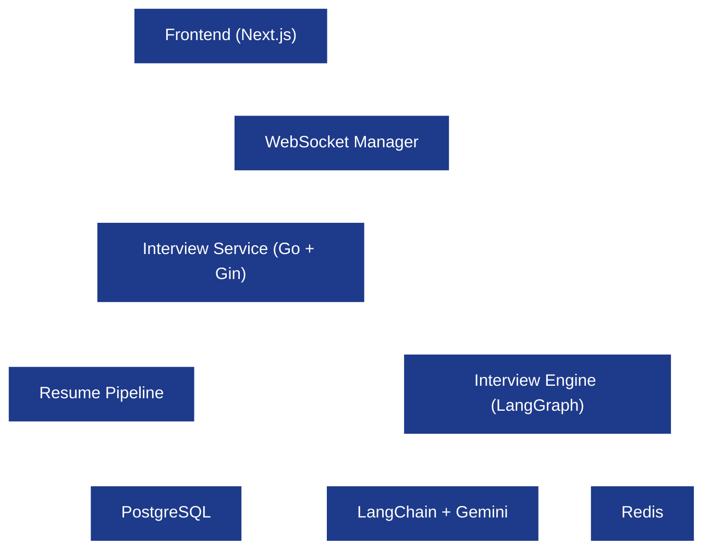
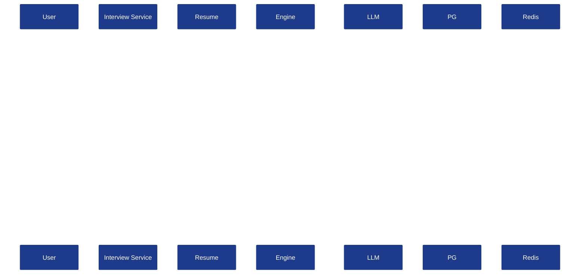
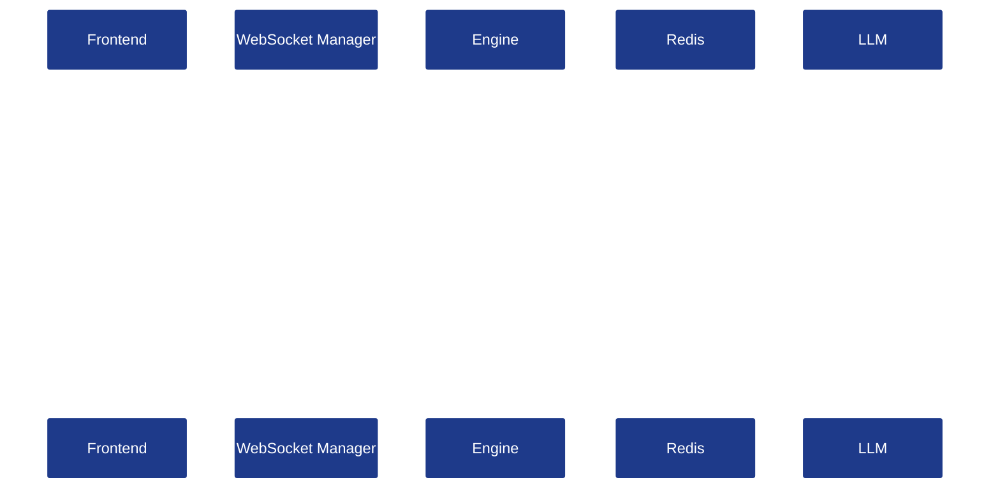

# System Architecture (HLD)

**Project:** AI Interview Service

**Document:** `docs/tech-spec/02_architecture.md`

**Version:** 1.0 (LOCKED)

---

# Ownership

**This document owns:**

- High-Level Architecture (HLD).
- Service boundaries.
- Communication between backend components.
- Request lifecycle.
- Runtime component responsibilities.

**References:**

- `01_tech_stack.md` → Technology choices.
- `03_folder_structure.md` → Package structure.
- `04_interview_engine.md` → Interview workflow.
- `05_resume_pipeline.md` → Resume processing internals.
- `08_redis_strategy.md` → Redis state design.

---

# 1. High-Level Architecture



---

# 2. Component Responsibilities

| Component | Responsibility |
|-----------|----------------|
| **Frontend** | Upload resume, manage interview UI, speech input/output. |
| **Interview Service** | REST APIs, authentication, session management, WebSocket entry point. |
| **Resume Pipeline** | Parse resume and generate structured interview intelligence. |
| **Interview Engine** | Execute LangGraph workflow and manage interview state. |
| **LangChain + Gemini** | Execute prompts and return structured responses. |
| **PostgreSQL** | Persistent application data. |
| **Redis** | Runtime interview state and caching. |

---

# 3. Runtime Data Ownership

| Storage | Owns |
|---------|------|
| **PostgreSQL** | Users, resumes, interview sessions, evaluations, metadata. |
| **Redis** | Current topic, covered topics, candidate memory, interview timers, active session state. |

Redis never becomes the source of truth.

---

# 4. Backend Request Flow



---

# 5. Interview Communication Flow



Speech is converted to text on the frontend before being sent through WebSocket.

---

# 6. Resume Processing Flow


Detailed implementation is defined in **`05_resume_pipeline.md`**.

---

# 7. Interview Engine Placement

The Interview Engine is an internal module inside the Interview Service.

```text
Interview Service
    ├── Resume Pipeline
    ├── Interview Engine
    ├── WebSocket Manager
    └── Storage Layer
```

The engine is responsible only for interview orchestration.

---

# 8. External Integrations

| Integration | Purpose |
|-------------|---------|
| Gemini | LLM reasoning. |
| LangChain | Prompt execution and structured output parsing. |
| Web Speech API | Speech-to-text and text-to-speech on frontend. |

No external service communicates directly with PostgreSQL or Redis.

---

# 9. Architecture Principles

- Stateless HTTP APIs.
- Stateful interview sessions through Redis.
- PostgreSQL as persistent storage.
- LangGraph controls interview workflow.
- LangChain abstracts the LLM provider.
- Resume parsing happens once before interview initialization.

---

# 10. Out of Scope

The following are intentionally documented elsewhere.

| Topic | Owner Document |
|-------|----------------|
| Folder Structure | `03_folder_structure.md` |
| Interview Workflow | `04_interview_engine.md` |
| Resume Parsing Logic | `05_resume_pipeline.md` |
| Prompt Design | `06_prompt_architecture.md` |
| Database Tables | `07_database_schema.md` |
| Redis Keys & TTLs | `08_redis_strategy.md` |
| WebSocket Events | `09_websocket_protocol.md` |