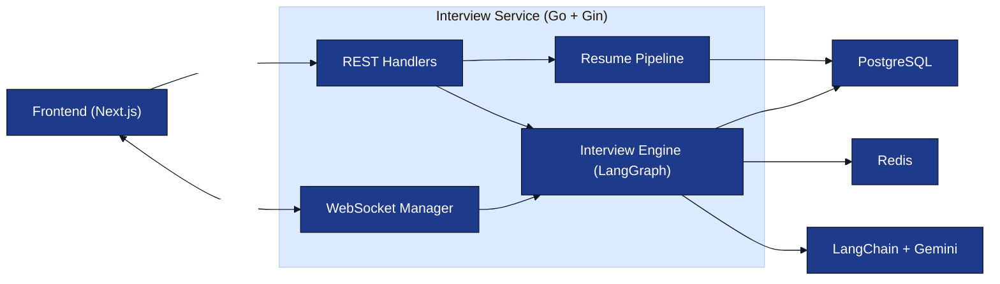
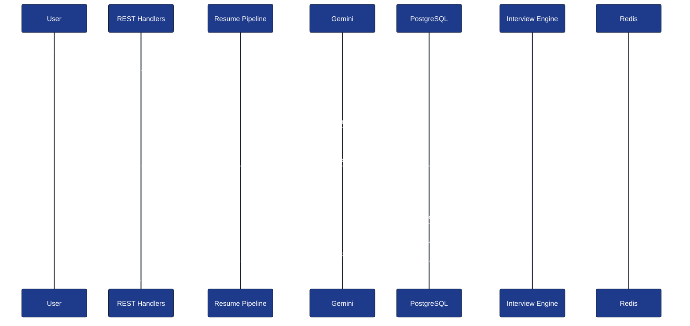
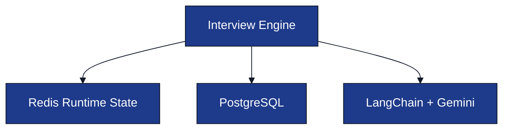

# System Architecture (HLD)

**Project:** AI Interview Service

**Document:** `docs/tech-spec/02_architecture.md`

**Version:** 1.0 (LOCKED)

---

# Ownership

**This document owns:**

- High-Level Architecture (HLD)
- Service boundaries
- Backend request lifecycle
- Runtime component responsibilities

**References**

- `01_tech_stack.md` → Technology decisions.
- `03_folder_structure.md` → Repository structure.
- `04_interview_engine.md` → Interview workflow and conversation loop.
- `05_resume_pipeline.md` → Resume parsing pipeline.
- `08_redis_strategy.md` → Redis runtime state.

---

# 1. High-Level Architecture



---

# 2. Component Responsibilities

| Component | Responsibility |
|-----------|----------------|
| **Frontend (Next.js)** | Resume upload, interview UI, speech input/output, WebSocket client. |
| **REST Handlers** | Authentication, resume upload, interview creation, profile APIs. |
| **WebSocket Manager** | Maintains interview WebSocket connections and routes messages to the Interview Engine. |
| **Resume Pipeline** | Converts uploaded resume into structured Resume Intelligence. |
| **Interview Engine** | Executes LangGraph workflow and controls interview progression. |
| **LangChain + Gemini** | Executes prompts and returns structured JSON responses. |
| **PostgreSQL** | Persistent application data. |
| **Redis** | Runtime interview session state. |

---

# 3. Runtime Data Ownership

| Storage | Responsibility |
|---------|----------------|
| **PostgreSQL** | Users, resumes, interview sessions, topic evaluations, final evaluations. |
| **Redis** | Current topic, covered topics, candidate memory, interview timer, active session state. |

**Design Rule**

- PostgreSQL is the **source of truth**.
- Redis stores temporary runtime state with TTL.
- Runtime state can always be reconstructed from PostgreSQL if required.

---

# 4. Interview Initialization Flow

This flow happens **once** before the interview starts.



**Result**

- Resume is parsed only once.
- Runtime state is initialized in Redis.
- First interviewer question is generated before WebSocket conversation begins.

---

# 5. Resume Processing Flow

```mermaid
%%{init:{
  "theme":"base",
  "themeVariables":{
    "background":"#FFFFFF",
    "primaryColor":"#1E3A8A",
    "primaryTextColor":"#FFFFFF",
    "primaryBorderColor":"#111827",
    "secondaryColor":"#2563EB",
    "secondaryTextColor":"#FFFFFF",
    "tertiaryColor":"#DBEAFE",
    "lineColor":"#111827",
    "edgeLabelBackground":"#FFFFFF",
    "fontFamily":"Inter"
  }
}}%%

flowchart LR

    PDF["Resume PDF"]

    EXTRACT["Extract & Normalize Text"]

    PARSER["LLM Resume Parser"]

    BUILDER["Resume Intelligence Builder"]

    STORE["PostgreSQL"]

    PDF --> EXTRACT
    EXTRACT --> PARSER
    PARSER --> BUILDER
    BUILDER --> STORE
```



The detailed pipeline is defined in **`05_resume_pipeline.md`**.

---

# 6. Runtime Architecture

The Interview Engine interacts with three runtime systems.



| Dependency | Purpose |
|------------|---------|
| **Redis** | Load and update active interview state. |
| **PostgreSQL** | Read resume intelligence and persist interview results. |
| **LangChain + Gemini** | Execute prompt for the current LangGraph node. |

---

# 7. Service Boundaries

```text
Interview Service
├── REST Handlers
├── WebSocket Manager
├── Resume Pipeline
├── Interview Engine
└── Storage Layer
```

Each module owns one responsibility and communicates through service interfaces.

---

# 8. External Integrations

| Integration | Purpose |
|-------------|---------|
| **Gemini** | LLM reasoning and structured generation. |
| **LangChain** | Prompt execution and structured output parsing. |
| **Web Speech API** | Speech-to-text and text-to-speech in the browser. |

The backend receives **text only** over WebSocket.

---

# 9. Architecture Principles

- Stateless REST APIs.
- Stateful interview sessions managed through Redis.
- PostgreSQL is the persistent source of truth.
- LangGraph orchestrates interview progression.
- LangChain abstracts the LLM provider.
- Resume parsing happens once before interview initialization.

---

# 10. Related Documents

| Topic | Document |
|-------|----------|
| Folder Structure | `03_folder_structure.md` |
| Interview Workflow & Conversation Loop | `04_interview_engine.md` |
| Resume Pipeline | `05_resume_pipeline.md` |
| Prompt Architecture | `06_prompt_architecture.md` |
| Database Schema | `07_database_schema.md` |
| Redis Strategy | `08_redis_strategy.md` |
| WebSocket Protocol | `09_websocket_protocol.md` |