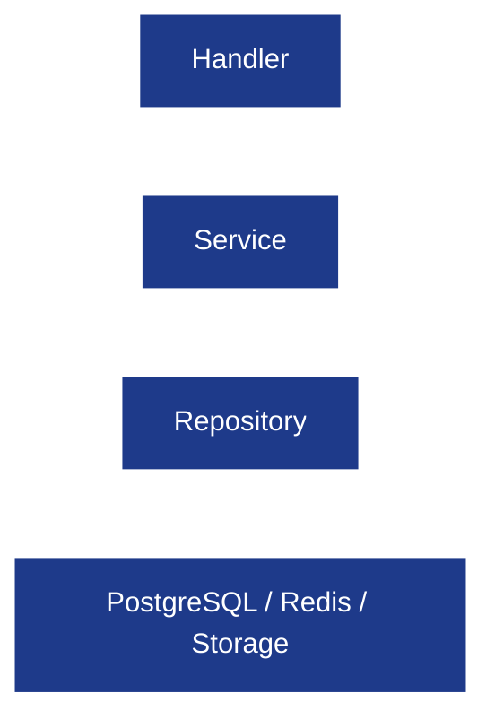
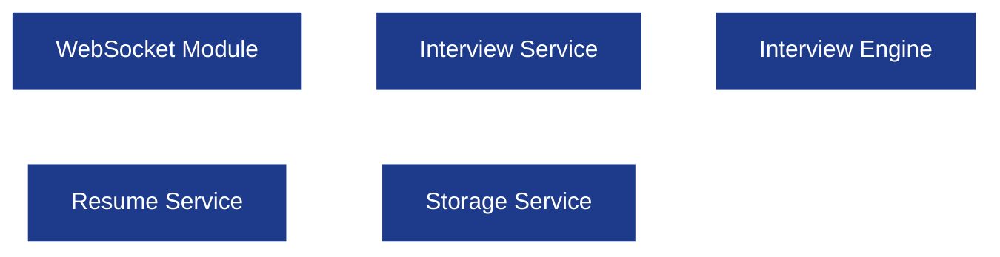

# Folder Structure

**Project:** AI Interview Service

**Document:** `docs/tech-spec/03_FOLDER_STRUCTURE.md`

**Version:** 1.0 (V1 Architecture)

**Status:** Locked

---

# 1. Purpose

This document defines the complete project structure for **AI Interview Service**.

The objective is to establish a consistent, scalable, and production-ready Go project layout before implementation begins.

This document specifies:

* Repository directory structure.
* Business domain organization.
* Layering conventions.
* Dependency rules.
* Naming conventions.
* Package ownership.

Every backend contributor should follow this document when creating new packages or files.

---

# 2. Project Structure

```text
ai-interview-service/
│
├── cmd/
│   └── server/
│       └── main.go                  # Application entrypoint
│
├── configs/                         # Configuration files & environment loading
│
├── docs/
│   ├── PRODUCT_SCOPE.md
│   ├── tech-spec/
│   └── decisions/
│
├── internal/
│   ├── app/
│   ├── middleware/
│   ├── shared/
│   ├── auth/
│   ├── user/
│   ├── resume/
│   ├── interview/
│   ├── websocket/
│   └── storage/
│
├── migrations/                      # SQL migrations
├── scripts/                         # Local development scripts
├── pkg/                             # Reusable generic packages
│
├── Dockerfile
├── docker-compose.yml
├── go.mod
└── README.md
```

---

# 3. Repository Organization Philosophy

The repository follows a **domain-first architecture**.

Instead of separating code by technical layers (`controllers`, `services`, `repositories` globally), every business domain owns its complete implementation.

## Why Domain-First?

* Better ownership boundaries.
* Easier navigation.
* Reduced coupling.
* Scales naturally as new domains are added.

Every business capability is isolated inside its own package.

---

# 4. Internal Package Structure

The `internal/` directory contains all application code.

```text
internal/
│
├── app/
├── middleware/
├── shared/
│
├── auth/
├── user/
├── resume/
├── interview/
├── websocket/
└── storage/
```

Only packages inside `internal/` are allowed to access application internals.

---

# 5. Module Responsibilities

| Module       | Responsibility                                                                    |
| ------------ | --------------------------------------------------------------------------------- |
| `app`        | Application bootstrap, dependency injection, router registration, server startup. |
| `middleware` | Authentication middleware, request logging, CORS, recovery, rate limiting.        |
| `shared`     | Shared utilities, constants, errors, helper functions, response utilities.        |
| `auth`       | Authentication and authorization.                                                 |
| `user`       | User profile and account management.                                              |
| `resume`     | Resume upload, extraction, parsing, validation, persistence.                      |
| `interview`  | Interview lifecycle, session management, Interview Engine integration.            |
| `websocket`  | WebSocket connection lifecycle and event routing.                                 |
| `storage`    | Object storage abstraction (S3 / Cloudflare R2).                                  |

---

# 6. Standard Domain Structure

Every business module follows the same structure.

Example (`resume/`):

```text
internal/resume/
│
├── handler.go
├── service.go
├── repository.go
├── model.go
├── dto.go
├── errors.go
└── validator.go
```

This structure is identical for `user`, `auth`, and `interview`.

---

## Layer Responsibilities

| File            | Responsibility                     |
| --------------- | ---------------------------------- |
| `handler.go`    | HTTP/WebSocket handlers.           |
| `service.go`    | Business logic and orchestration.  |
| `repository.go` | PostgreSQL operations.             |
| `model.go`      | Persistent database entities.      |
| `dto.go`        | Request/response DTOs.             |
| `validator.go`  | Domain-specific validation.        |
| `errors.go`     | Domain-specific error definitions. |

---

# 7. Interview Module Structure

The interview module owns interview sessions and AI orchestration.

```text
internal/interview/
│
├── handler.go
├── service.go
├── repository.go
├── model.go
├── dto.go
├── session_manager.go
├── types.go
├── errors.go
│
└── engine/
    ├── graph/
    ├── nodes/
    ├── prompts/
    ├── provider/
    ├── memory/
    ├── evaluator/
    ├── schemas/
    └── utils/
```

The Interview Engine is intentionally isolated inside the interview domain.

---

# 8. Interview Engine Structure

## Purpose

The Interview Engine owns all AI intelligence required to conduct interviews.

```text
engine/
│
├── graph/
├── nodes/
├── prompts/
├── provider/
├── memory/
├── evaluator/
├── schemas/
└── utils/
```

### Ownership

| Package     | Responsibility                                         |
| ----------- | ------------------------------------------------------ |
| `graph`     | LangGraph workflow definition.                         |
| `nodes`     | Individual LangGraph nodes.                            |
| `prompts`   | Version-controlled prompt templates.                   |
| `provider`  | LangChain provider abstraction and Gemini integration. |
| `memory`    | Candidate memory model.                                |
| `evaluator` | Candidate answer evaluation logic.                     |
| `schemas`   | Structured LLM JSON schemas.                           |
| `utils`     | Shared Interview Engine utilities.                     |

---

## Interview Engine Boundary

The Interview Engine **does not** know about:

* HTTP requests.
* JWT.
* PostgreSQL.
* Object storage.
* WebSocket implementation.

It receives structured input and returns structured output.

---

# 9. Resume Module Structure

The resume module owns the complete resume pipeline.

```text
internal/resume/
│
├── handler.go
├── service.go
├── repository.go
├── parser.go
├── extractor.go
├── validator.go
├── model.go
├── dto.go
└── errors.go
```

### Responsibilities

| File           | Responsibility                                   |
| -------------- | ------------------------------------------------ |
| `extractor.go` | PDF → raw text extraction.                       |
| `parser.go`    | Resume parsing orchestration using LLM provider. |
| `validator.go` | Parsed resume schema validation.                 |

The Interview Engine never parses PDFs directly.

---

# 10. WebSocket Module Structure

The WebSocket module owns connection lifecycle management.

```text
internal/websocket/
│
├── handler.go
├── manager.go
├── client.go
├── hub.go
├── events.go
├── dispatcher.go
└── errors.go
```

### Responsibilities

| File            | Responsibility                        |
| --------------- | ------------------------------------- |
| `handler.go`    | Upgrade HTTP connection to WebSocket. |
| `manager.go`    | Connection lifecycle management.      |
| `hub.go`        | Active client registry.               |
| `dispatcher.go` | Event routing.                        |
| `events.go`     | WebSocket event definitions.          |
| `client.go`     | Connected client abstraction.         |

The WebSocket module does **not** contain interview business logic.

---

# 11. Storage Module Structure

Object storage is isolated behind a storage abstraction.

```text
internal/storage/
│
├── service.go
├── provider.go
├── s3.go
├── r2.go
└── errors.go
```

### Responsibilities

* Upload resume.
* Delete resume.
* Generate storage paths.
* Generate signed URLs.

The rest of the application never communicates directly with S3.

---

# 12. Shared Package Structure

The shared package contains reusable application utilities.

```text
internal/shared/
│
├── constants/
├── errors/
├── logger/
├── response/
├── utils/
└── validator/
```

### Shared Package Rules

Allowed:

* Constants.
* Generic helpers.
* Shared response utilities.
* Shared validation helpers.

Not Allowed:

* Business logic.
* Database queries.
* LLM logic.

---

# 13. App Package Structure

The app package bootstraps the application.

```text
internal/app/
│
├── server.go
├── router.go
├── container.go
├── config.go
└── bootstrap.go
```

### Responsibilities

* Initialize configuration.
* Connect PostgreSQL.
* Connect Redis.
* Initialize storage provider.
* Register routes.
* Wire dependencies.

Business logic never lives inside `app/`.

---

# 14. Dependency Direction

Every package has a fixed dependency direction.



### Dependency Rules

| Allowed                    | Not Allowed                |
| -------------------------- | -------------------------- |
| Handler → Service          | Handler → Repository       |
| Service → Repository       | Repository → Service       |
| Service → Shared           | Repository → Handler       |
| Service → Storage          | Handler → Database         |
| Service → Interview Engine | Interview Engine → Handler |

These rules prevent circular dependencies.

---

# 15. Module Interaction Rules

Business domains communicate through services, not repositories.



### Interaction Rules

* WebSocket talks to Interview Service.
* Interview Service talks to Interview Engine.
* Resume Service talks to Storage Service.
* Resume Service never talks directly to Interview Engine.

---

# 16. Interface Conventions

Interfaces are owned by the consumer package.

Example:

```go
type ResumeRepository interface {}
```

### Why?

* Easier mocking.
* Better dependency inversion.
* Cleaner unit tests.

---

## Standard Interfaces

| Interface               | Owned By          |
| ----------------------- | ----------------- |
| Repository Interface    | Service Package   |
| Storage Interface       | Storage Package   |
| LLM Provider Interface  | Interview Engine  |
| Session Store Interface | Interview Service |

---

# 17. Naming Conventions

## Packages

* Lowercase.
* Singular names.
* No underscores.

Examples:

```text
resume
interview
storage
middleware
```

---

## Files

| Type       | Naming          |
| ---------- | --------------- |
| Handler    | `handler.go`    |
| Service    | `service.go`    |
| Repository | `repository.go` |
| DTO        | `dto.go`        |
| Model      | `model.go`      |
| Errors     | `errors.go`     |
| Validator  | `validator.go`  |

---

## DTO Naming

```go
CreateInterviewRequest
ResumeUploadRequest
InterviewResponse
```

---

## Model Naming

```go
User
Resume
InterviewSession
InterviewMessage
```

---

## Error Naming

```go
ErrResumeNotFound
ErrInterviewExpired
ErrUnauthorized
```

---

# 18. Import Rules

To avoid circular dependencies:

### Allowed Imports

```text
handler
   ↓
service
   ↓
repository
   ↓
database
```

### Forbidden Imports

* Handler importing repository.
* Repository importing handler.
* Shared importing business modules.
* Engine importing auth or websocket packages.

---

# 19. Testing Structure

Tests live beside production files.

Example:

```text
service.go
service_test.go

repository.go
repository_test.go

handler.go
handler_test.go
```

### Testing Philosophy

* Unit test services.
* Mock repositories.
* Mock storage provider.
* Mock LLM provider.

No real external dependencies in unit tests.

---

# 20. Best Practices

* Every domain owns its complete implementation.
* Keep handlers thin.
* Keep services responsible for orchestration.
* Keep repositories responsible for persistence only.
* Keep AI isolated inside `interview/engine`.
* Never expose internal models directly through APIs.
* Avoid circular imports through dependency direction rules.

---

# 21. Future Scope

The following directories may be introduced in future versions:

| Directory                 | Purpose                                |
| ------------------------- | -------------------------------------- |
| `internal/analytics/`     | Interview analytics and metrics.       |
| `internal/billing/`       | Subscription management.               |
| `internal/notifications/` | Email and push notifications.          |
| `internal/jobs/`          | Background workers and scheduled jobs. |
| `internal/search/`        | Semantic search and vector retrieval.  |

These are intentionally excluded from V1.

---

# Revision History

| Version | Changes                                                         |
| ------- | --------------------------------------------------------------- |
| **1.0** | Initial production folder structure and dependency conventions. |
