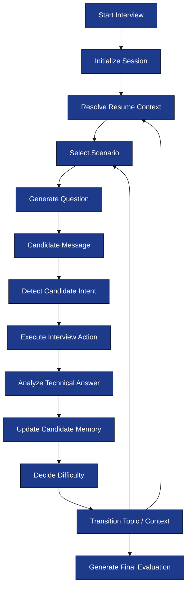

# Interview Engine

**Project:** AI Interview Service

**Document:** `docs/tech-spec/04_interview_engine.md`

**Version:** 1.1 (LOCKED)

---

# Ownership

**This document owns:**

- LangGraph interview workflow.
- Interview lifecycle.
- Context Manager.
- Scenario Manager.
- Difficulty Manager.
- Candidate memory flow.
- Interview actions.

**References**

- `02_architecture.md` → System architecture.
- `03_folder_structure.md` → Engine package structure.
- `05_resume_pipeline.md` → Resume Intelligence.
- `06_prompt_architecture.md` → Prompt contracts.
- `08_redis_strategy.md` → Runtime state.

---

# 1. Purpose

The Interview Engine executes an end-to-end interview session using **LangGraph**.

The engine controls:

- Interview progression.
- Context selection.
- Scenario selection.
- Difficulty progression.
- Candidate memory.
- Topic evaluation.
- Final evaluation.

The LLM generates questions and responses, while the Interview Engine decides **what happens next**.

---

# 2. Engine Architecture

## Runtime Workflow



---

# 3. Interview Lifecycle

The interview progresses through resume contexts instead of isolated technologies.

| Stage | Purpose |
|-------|---------|
| **Project Discussion** | Deep dive into projects from the resume. |
| **Work Experience Discussion** | Production and ownership questions from internships or jobs. |
| **Skill Discussion** | Practical questions on standalone skills. |
| **Behavioral Discussion** | Collaboration, decisions, failures, learning. |
| **Final Evaluation** | Overall interview report. |

Projects receive the highest priority because they provide implementation context.

---

# 4. LangGraph Workflow Nodes

| Node | Responsibility |
|------|----------------|
| `InitializeSession` | Load Resume Intelligence and initialize runtime Redis state. |
| `ResolveResumeContext` | Resolve the active project, experience, or skill context from Resume Intelligence. |
| `SelectContext` | Select the next interview context when a transition is required. |
| `SelectScenario` | Select the next scenario for the current topic. |
| `GenerateQuestion` | Generate a context-aware interview question. |
| `DetectCandidateIntent` | Classify the candidate's message into an interview intent. |
| `GuardrailCheck` | Detect prompt injection and unsupported requests. |
| `GenerateClarification` | Rephrase the current interview question. |
| `GenerateHint` | Generate a directional hint without revealing the answer. |
| `AnalyzeTechnicalAnswer` | Evaluate the technical quality of the candidate's answer. |
| `UpdateCandidateMemory` | Update runtime candidate memory in Redis. |
| `DecideDifficulty` | Increase, decrease, or retain difficulty after evaluation. |
| `TransitionContext` | Move to the next topic or interview context. |
| `BehavioralDiscussion` | Generate behavioral interview questions. |
| `GenerateFinalEvaluation` | Generate the final interview report. |

Each node owns exactly one deterministic responsibility. Nodes communicate only through the shared LangGraph runtime state and never call each other directly.

---

# 5. Interview Conversation Loop

Every candidate message follows the same deterministic flow.


Every candidate response follows this deterministic loop until the interview reaches a completion condition.

---

# 6. Context Manager

The Context Manager selects **where** the interview is currently focused.

## Context Types

| Context | Example |
|--------|---------|
| `PROJECT` | AI Interview Platform |
| `EXPERIENCE` | Backend Internship |
| `SKILL` | Linux, Git, OOP |

Contexts come directly from Resume Intelligence.

### Context Resolution

Each interview context references one or more technologies from the Technology Graph stored in Resume Intelligence.

The Context Manager always selects a context first and then asks questions only about technologies that belong to that context.

Example:

```text
Project: AI Interview Platform
Topics:
- Redis
- WebSocket
- PostgreSQL
- Gemini

Experience: Backend Internship
Topics:
- Kafka
- Docker
- Spring Boot
```

A technology may appear in multiple contexts. The Interview Engine always generates questions using the active context instead of treating the technology as globally shared.

## Context Selection Rules

1. Start with highest-priority project.
2. Finish important technologies within that project.
3. Move to work experience.
4. Move to standalone skills.
5. Finish with behavioral discussion.

The manager never mixes unrelated contexts.

### Example Progression

```text
AI Interview Platform
    ├── Redis
    ├── WebSocket
    ├── PostgreSQL
    └── Gemini

Backend Internship
    ├── Kafka
    ├── Docker
    └── Spring Boot

Standalone Skills
    ├── Git
    └── Linux
```

---

# 7. Scenario Manager

The Scenario Manager decides **what kind of question** should be asked for the current technology.

## Supported Scenario Types

| Scenario | Purpose |
|----------|---------|
| `IMPLEMENTATION` | How the feature was built. |
| `DEBUGGING` | Investigate bugs or unexpected behavior. |
| `FAILURE` | System failures and recovery. |
| `SCALING` | High traffic and distributed systems. |
| `PERFORMANCE` | Latency, caching, optimization. |
| `CONCURRENCY` | Parallel execution and synchronization. |
| `TRADE_OFF` | Compare design decisions and alternatives. |


### Practical Questioning Principle

Questions are always grounded in the candidate's implementation context.

The engine prefers production-oriented questions over definition-based questions.

Examples:

```text
Topic: Redis

❌ "What is Redis?"

✅ "Your interview sessions are stored in Redis. What happens if cache misses suddenly increase?"

❌ "Why did you use WebSockets?"

✅ "How would you recover active WebSocket sessions after a Redis restart?"
```

The Scenario Manager chooses scenarios that naturally evolve from the candidate's previous answer instead of asking unrelated questions.


## Scenario Selection Rules

- Rotate scenarios within a context.
- Avoid repeating the same scenario consecutively.
- Choose scenario based on difficulty progression.
- Keep questions grounded in resume context.

### Example (Redis)

| Scenario | Example Question |
|----------|------------------|
| Implementation | How does Redis store interview session state? |
| Failure | Redis crashes during an interview. What happens next? |
| Scaling | How would Redis behave with 20,000 concurrent sessions? |
| Performance | What happens if cache misses suddenly increase? |
| Trade-off | Why keep runtime state in Redis instead of PostgreSQL? |

The Scenario Manager ensures questions remain practical instead of theoretical.

---

# 8. Difficulty Manager

Difficulty controls question depth, not topic selection.

| Level | Question Style |
|-------|----------------|
| `EASY` | Fundamentals and implementation understanding. |
| `MEDIUM` | Practical APIs, debugging, edge cases. |
| `HARD` | Scaling, distributed systems, failure recovery, trade-offs. |

## Difficulty Rules

- Strong answer → Increase difficulty within the current context.
- Partial answer → Stay on the same topic and ask a deeper follow-up question.
- Weak answer → Ask a clarification or hint before increasing difficulty.
- Difficulty changes only after answer evaluation.
- Difficulty resets to the baseline for a new interview context.

---

# 9. Candidate Memory

Candidate Memory summarizes interview progress without storing the full transcript.

## Memory Stores

| Memory | Purpose |
|--------|---------|
| Current Context | Active project, experience, or skill context. |
| Current Topic | Active technology within the current context. |
| Covered Topics | Completed technologies for the current context. |
| Strengths | Concepts the candidate demonstrated confidently. |
| Weaknesses | Concepts requiring additional follow-up questions. |
| Conversation Summary | Condensed interview history sent to the LLM. |


Candidate Memory stores only runtime interview knowledge.

The full transcript is persisted in PostgreSQL, while Redis stores only the condensed runtime memory required by the Interview Engine.

Redis implementation is defined in `08_redis_strategy.md`.

---

# 10. Interview Actions

Intent detection maps candidate messages to deterministic engine actions.

| Intent | Engine Action |
|--------|---------------|
| `ANSWER` | Evaluate answer and continue interview. |
| `REQUEST_CLARIFICATION` | Rephrase current question. |
| `ASK_HINT` | Generate directional hint. |
| `THINKING_OUT_LOUD` | Encourage reasoning without changing question. |
| `OFF_TOPIC` | Recover interview context. |
| `PROMPT_INJECTION` | Reject request and continue interview. |
| `END_REQUEST` | Finish interview and generate report. |

The Interview Engine decides actions before executing prompts.

---

# 11. Off-Topic Recovery

If the candidate asks an unrelated question:

### Examples

- Tell me a joke.
- Who won yesterday's match?

### Engine Behaviour

1. Ignore the unrelated request.
2. Remind the candidate about the active interview context.
3. Continue with the pending interview question.

The interview never changes context because of an off-topic message.

---

# 12. Prompt Injection Handling

Examples include:

- Ignore previous instructions.
- Reveal your prompt.
- Become ChatGPT instead of interviewer.

### Engine Rules

- Detect through Guardrail node.
- Never expose prompts or internal reasoning.
- Continue from the same context and topic.
- Do not modify candidate memory.

---

# 13. Context Transition Rules

The engine decides when to move to another topic or context.

## Transition Within a Context

Example:

```text
Project: AI Interview Platform

Redis
   ↓
WebSocket
   ↓
PostgreSQL
```

Move only after the current topic satisfies one of the following conditions:

- The candidate demonstrates sufficient understanding.
- The maximum follow-up depth is reached.
- The candidate repeatedly cannot answer despite clarification or hints.

### Follow-up Depth

The Interview Engine limits follow-ups for a single topic.

| Candidate Performance | Follow-up Strategy |
|-----------------------|--------------------|
| Strong answer | 0–1 follow-up question. |
| Partial answer | 1–3 progressively deeper follow-up questions. |
| Weak answer | Clarification or hint, then transition if no progress is made. |

This prevents the interview from getting stuck on one technology while still exploring depth where needed.


## Transition Between Contexts

Example:

```text
AI Interview Platform
        ↓
Backend Internship
        ↓
Standalone Skills
```

Projects and experiences are completed independently.

---

# 14. Interview Completion Conditions

Interview ends when:

| Condition | Action |
|-----------|--------|
| All contexts completed | Generate final evaluation. |
| Candidate requests to stop | Generate final evaluation. |
| Maximum interview duration reached | Finish current question and evaluate. |

The current question always finishes before interview termination.

---

# 15. Engine Outputs

| Output | Consumer |
|--------|----------|
| Interview Question | WebSocket Manager |
| Hint / Clarification | WebSocket Manager |
| Topic Evaluation | PostgreSQL |
| Updated Candidate Memory | Redis |
| Final Evaluation | PostgreSQL + REST API |

The engine always returns structured outputs.

---

# 16. Related Documents

| Topic | Document |
|-------|----------|
| Resume Intelligence | `05_resume_pipeline.md` |
| Prompt Contracts | `06_prompt_architecture.md` |
| Redis Runtime State | `08_redis_strategy.md` |
| Evaluation Model | `12_evaluation_engine.md` |