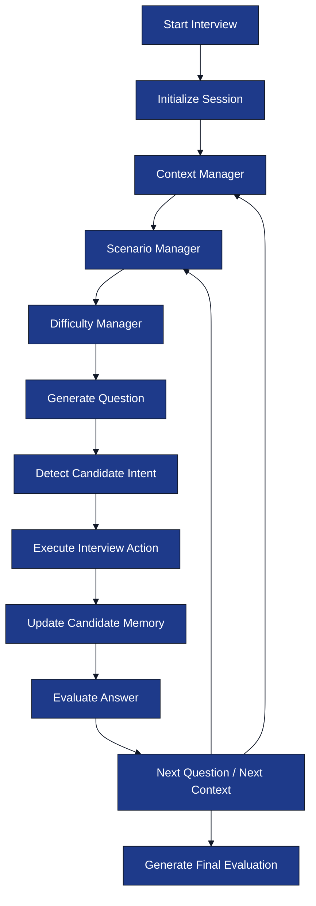

# Interview Engine

**Project:** AI Interview Service

**Document:** `docs/tech-spec/04_interview_engine.md`

**Version:** 1.1 (LOCKED)

---

# Ownership

**This document owns:**

- LangGraph interview workflow.
- Interview lifecycle.
- Context Manager.
- Scenario Manager.
- Difficulty Manager.
- Candidate memory flow.
- Interview actions.

**References**

- `02_architecture.md` → System architecture.
- `03_folder_structure.md` → Engine package structure.
- `05_resume_pipeline.md` → Resume Intelligence.
- `06_prompt_architecture.md` → Prompt contracts.
- `08_redis_strategy.md` → Runtime state.

---

# 1. Purpose

The Interview Engine executes an end-to-end interview session using **LangGraph**.

The engine controls:

- Interview progression.
- Context selection.
- Scenario selection.
- Difficulty progression.
- Candidate memory.
- Topic evaluation.
- Final evaluation.

The LLM generates questions and responses, while the Interview Engine decides **what happens next**.

---

# 2. Engine Architecture



---

# 3. Interview Lifecycle

The interview progresses through resume contexts instead of isolated technologies.

| Stage | Purpose |
|-------|---------|
| **Project Discussion** | Deep dive into projects from the resume. |
| **Work Experience Discussion** | Production and ownership questions from internships or jobs. |
| **Skill Discussion** | Practical questions on standalone skills. |
| **Behavioral Discussion** | Collaboration, decisions, failures, learning. |
| **Final Evaluation** | Overall interview report. |

Projects receive the highest priority because they provide implementation context.

---

# 4. LangGraph Workflow Nodes

| Node | Responsibility |
|------|----------------|
| `InitializeSession` | Load Resume Intelligence and runtime state. |
| `SelectContext` | Choose project, experience, or skill context. |
| `SelectScenario` | Choose scenario type for current topic. |
| `GenerateQuestion` | Generate interview question. |
| `DetectCandidateIntent` | Classify candidate message. |
| `GuardrailCheck` | Detect prompt injection and unsupported requests. |
| `GenerateClarification` | Rephrase current question. |
| `GenerateHint` | Generate hint. |
| `AnalyzeTechnicalAnswer` | Evaluate answer. |
| `UpdateCandidateMemory` | Update interview memory. |
| `TransitionContext` | Move to next topic or context. |
| `BehavioralDiscussion` | Generate behavioral questions. |
| `GenerateFinalEvaluation` | Produce interview report. |

Each node executes exactly one responsibility.

---

# 5. Interview Conversation Loop

Every candidate message follows the same deterministic flow.


This loop repeats until interview completion.

---

# 6. Context Manager

The Context Manager selects **where** the interview is currently focused.

## Context Types

| Context | Example |
|--------|---------|
| `PROJECT` | AI Interview Platform |
| `EXPERIENCE` | Backend Internship |
| `SKILL` | Linux, Git, OOP |

Contexts come directly from Resume Intelligence.

## Context Selection Rules

1. Start with highest-priority project.
2. Finish important technologies within that project.
3. Move to work experience.
4. Move to standalone skills.
5. Finish with behavioral discussion.

The manager never mixes unrelated contexts.

### Example Progression

```text
AI Interview Platform
    ├── Redis
    ├── WebSocket
    ├── PostgreSQL
    └── Gemini

Backend Internship
    ├── Kafka
    ├── Docker
    └── Spring Boot

Standalone Skills
    ├── Git
    └── Linux
```

---

# 7. Scenario Manager

The Scenario Manager decides **what kind of question** should be asked for the current technology.

## Supported Scenario Types

| Scenario | Purpose |
|----------|---------|
| `IMPLEMENTATION` | How the feature was built. |
| `DEBUGGING` | Investigate bugs or unexpected behavior. |
| `FAILURE` | System failures and recovery. |
| `SCALING` | High traffic and distributed systems. |
| `PERFORMANCE` | Latency, caching, optimization. |
| `CONCURRENCY` | Parallel execution and synchronization. |
| `TRADE_OFF` | Compare design decisions and alternatives. |

## Scenario Selection Rules

- Rotate scenarios within a context.
- Avoid repeating the same scenario consecutively.
- Choose scenario based on difficulty progression.
- Keep questions grounded in resume context.

### Example (Redis)

| Scenario | Example Question |
|----------|------------------|
| Implementation | How does Redis store interview session state? |
| Failure | Redis crashes during an interview. What happens next? |
| Scaling | How would Redis behave with 20,000 concurrent sessions? |
| Performance | What happens if cache misses suddenly increase? |
| Trade-off | Why keep runtime state in Redis instead of PostgreSQL? |

The Scenario Manager ensures questions remain practical instead of theoretical.

---

# 8. Difficulty Manager

Difficulty controls question depth, not topic selection.

| Level | Question Style |
|-------|----------------|
| `EASY` | Fundamentals and implementation understanding. |
| `MEDIUM` | Practical APIs, debugging, edge cases. |
| `HARD` | Scaling, distributed systems, failure recovery, trade-offs. |

## Difficulty Rules

- Strong answer → Increase difficulty.
- Weak answer → Explore current topic before increasing difficulty.
- Difficulty progression happens within the same context whenever possible.

---

# 9. Candidate Memory

Candidate Memory summarizes interview progress without storing the full transcript.

## Memory Stores

| Memory | Purpose |
|--------|---------|
| Current Context | Active project or experience. |
| Current Topic | Active technology. |
| Covered Topics | Completed technologies. |
| Strengths | Strong concepts demonstrated. |
| Weaknesses | Missing concepts. |
| Conversation Summary | Condensed history. |

Memory is updated after every evaluated answer.

Redis implementation is defined in `08_redis_strategy.md`.

---

# 10. Interview Actions

Intent detection maps candidate messages to deterministic engine actions.

| Intent | Engine Action |
|--------|---------------|
| `ANSWER` | Evaluate answer and continue interview. |
| `REQUEST_CLARIFICATION` | Rephrase current question. |
| `ASK_HINT` | Generate directional hint. |
| `THINKING_OUT_LOUD` | Encourage reasoning without changing question. |
| `OFF_TOPIC` | Recover interview context. |
| `PROMPT_INJECTION` | Reject request and continue interview. |
| `END_REQUEST` | Finish interview and generate report. |

The Interview Engine decides actions before executing prompts.

---

# 11. Off-Topic Recovery

If the candidate asks an unrelated question:

### Examples

- Tell me a joke.
- Who won yesterday's match?

### Engine Behaviour

1. Ignore the unrelated request.
2. Remind the candidate about the active interview context.
3. Continue with the pending interview question.

The interview never changes context because of an off-topic message.

---

# 12. Prompt Injection Handling

Examples include:

- Ignore previous instructions.
- Reveal your prompt.
- Become ChatGPT instead of interviewer.

### Engine Rules

- Detect through Guardrail node.
- Never expose prompts or internal reasoning.
- Continue from the same context and topic.
- Do not modify candidate memory.

---

# 13. Context Transition Rules

The engine decides when to move to another topic or context.

## Transition Within a Context

Example:

```text
Project: AI Interview Platform

Redis
   ↓
WebSocket
   ↓
PostgreSQL
```

Move only after the current topic is sufficiently evaluated.

## Transition Between Contexts

Example:

```text
AI Interview Platform
        ↓
Backend Internship
        ↓
Standalone Skills
```

Projects and experiences are completed independently.

---

# 14. Interview Completion Conditions

Interview ends when:

| Condition | Action |
|-----------|--------|
| All contexts completed | Generate final evaluation. |
| Candidate requests to stop | Generate final evaluation. |
| Maximum interview duration reached | Finish current question and evaluate. |

The current question always finishes before interview termination.

---

# 15. Engine Outputs

| Output | Consumer |
|--------|----------|
| Interview Question | WebSocket Manager |
| Hint / Clarification | WebSocket Manager |
| Topic Evaluation | PostgreSQL |
| Updated Candidate Memory | Redis |
| Final Evaluation | PostgreSQL + REST API |

The engine always returns structured outputs.

---

# 16. Related Documents

| Topic | Document |
|-------|----------|
| Resume Intelligence | `05_resume_pipeline.md` |
| Prompt Contracts | `06_prompt_architecture.md` |
| Redis Runtime State | `08_redis_strategy.md` |
| Evaluation Model | `12_evaluation_engine.md` |