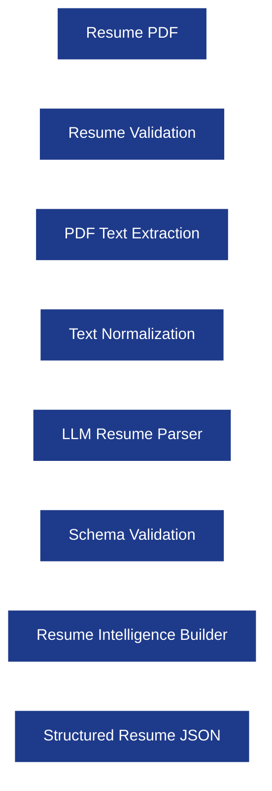
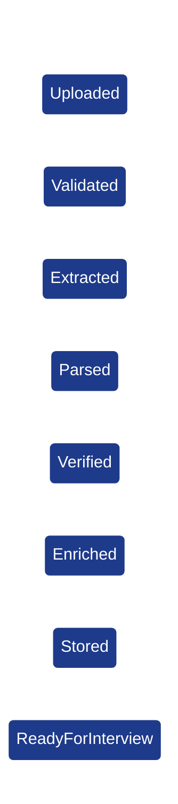
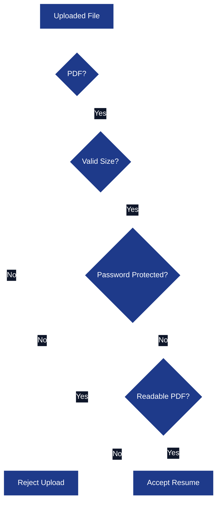
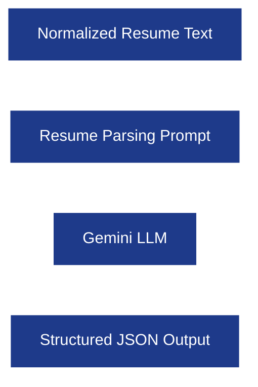
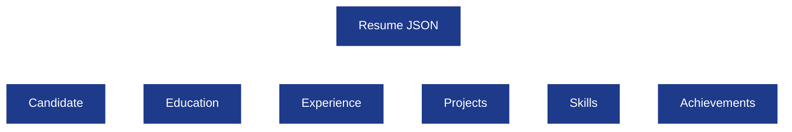
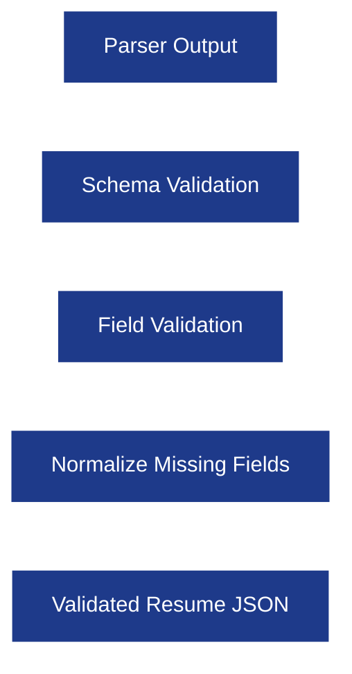
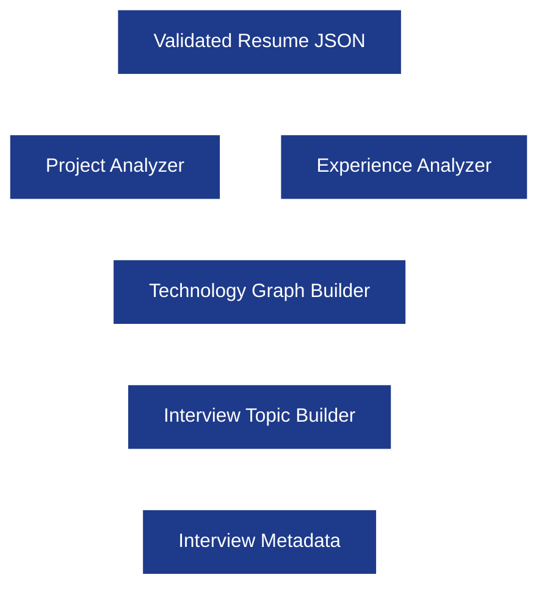
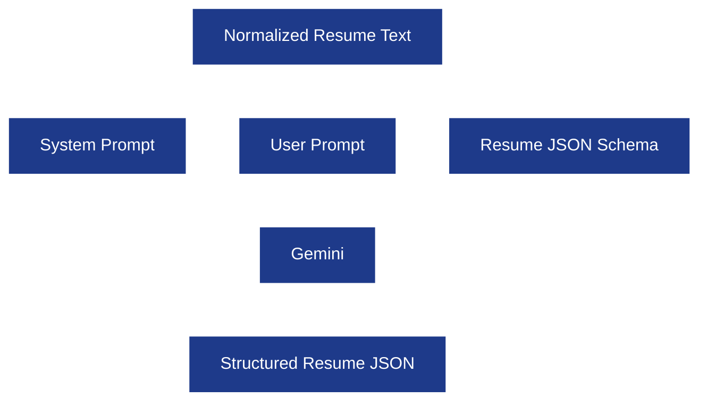
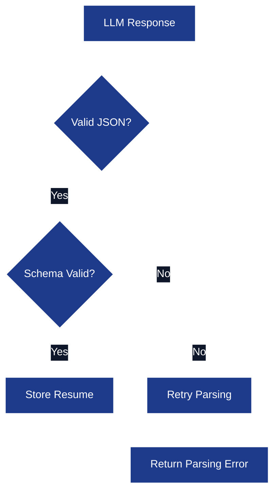
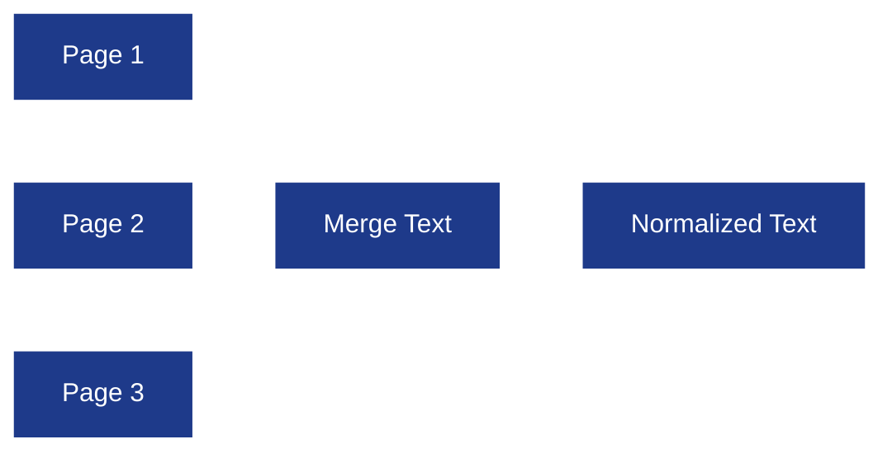

# Resume Intelligence Pipeline

**Project:** AI Interview Service

**Document:** `docs/tech-spec/05_RESUME_PIPELINE.md`

**Version:** 1.0 (Production V1)

**Status:** Locked

---

# 1. Purpose

The Resume Intelligence Pipeline converts an uploaded resume into a structured representation that can be consumed by the Interview Engine.

A resume is an unstructured PDF with inconsistent layouts, missing sections, different templates, icons, columns, tables, and formatting. The Interview Engine cannot consume raw text directly.

The pipeline transforms the resume into **validated structured JSON** while preserving enough context for realistic interview generation.

---

## Goals

- Accept resumes in different layouts and formats.
- Extract structured information reliably.
- Validate extracted information before storing it.
- Handle missing or malformed resume sections gracefully.
- Generate interview-ready resume context.
- Produce deterministic JSON consumed by the Interview Engine.

---

## Non Goals (V1)

The pipeline does **not**:

- Rank resumes.
- Generate ATS scores.
- Compare resumes with Job Descriptions.
- Generate resume improvements.
- Perform semantic retrieval using embeddings.

These are future features.

---

# 2. High-Level Architecture

The pipeline consists of multiple deterministic stages instead of sending the entire PDF directly to the LLM.



---

## Pipeline Philosophy

Every stage has exactly one responsibility.

| Stage | Responsibility |
|-------|----------------|
| Validation | Verify uploaded file is acceptable. |
| Extraction | Extract raw text from PDF. |
| Normalization | Clean extracted text. |
| Parsing | Convert text into structured JSON. |
| Validation | Ensure JSON follows backend schema. |
| Intelligence Builder | Generate interview metadata and topics. |

This makes the pipeline observable and retryable.

---

# 3. Resume Processing Lifecycle

A resume goes through several backend stages before it is available for interviews.



---

## Lifecycle Stages

| Stage | Purpose |
|-------|---------|
| Uploaded | Resume received from frontend. |
| Validated | File passes validation rules. |
| Extracted | Text extracted from PDF. |
| Parsed | Structured resume generated. |
| Verified | JSON schema validated. |
| Enriched | Interview topics and metadata generated. |
| Stored | Resume persisted in PostgreSQL. |
| ReadyForInterview | Interview Engine can consume resume. |

---

# 4. Resume Validation Layer

Validation happens **before** reading the PDF.

This protects the backend from malformed uploads and unsupported files.

---

## Validation Responsibilities

- Verify MIME type.
- Verify file extension.
- Verify file size.
- Reject corrupted PDFs.
- Reject password-protected PDFs.

---

## Validation Rules

| Rule | Behavior |
|------|----------|
| File type must be PDF. | Reject otherwise. |
| Maximum file size. | Reject oversized uploads. |
| Password protected PDF. | Reject upload. |
| Corrupted PDF. | Reject upload. |
| Empty PDF. | Reject upload. |

Configuration values (file size limits, etc.) will live in application config.

---

## Validation Flow



---

## Error Strategy

Validation errors are deterministic.

| Error | Message |
|------|---------|
| Invalid file type | "Please upload a PDF resume." |
| File too large | "Resume exceeds maximum allowed size." |
| Password protected | "Password-protected PDFs are not supported." |
| Corrupted file | "Unable to read the uploaded resume." |

The LLM is never invoked for invalid files.

---

# 5. PDF Text Extraction

The extraction stage converts PDF pages into readable text.

This stage performs **no AI parsing**.

---

## Responsibilities

- Read PDF pages.
- Preserve reading order as much as possible.
- Remove rendering artifacts.
- Extract Unicode text.
- Produce normalized raw text.

---

## Extraction Output

```text
John Doe

Software Engineer

Experience

Razorpay
Software Development Intern

Projects

Analytics Service
...
```

The output is plain text.

---

## Why Separate Extraction From Parsing?

Keeping extraction deterministic gives several benefits:

- Easier debugging.
- Easier retries.
- Parser always receives normalized input.
- Different PDF libraries can be swapped later.

---

## Extraction Pipeline


---

## Supported Resume Layouts

The extractor should work for common resume formats.

| Layout | Supported |
|--------|-----------|
| Single-column resumes | Yes |
| Two-column resumes | Yes |
| Modern ATS templates | Yes |
| LaTeX resumes | Yes |
| Canva-style resumes with selectable text | Yes |

Image-only resumes are handled later in V2.

---

# 6. Text Normalization

Raw extracted text is inconsistent.

Normalization prepares text for the LLM parser.

---

## Responsibilities

- Normalize whitespace.
- Remove duplicate blank lines.
- Normalize bullet characters.
- Remove decorative icons.
- Preserve section boundaries.

---

## Example

### Before

```text
• Kafka

• Redis

Software Engineer  |  Razorpay
```

### After

```text
Kafka
Redis

Software Engineer
Razorpay
```

---

## Normalization Rules

| Rule | Purpose |
|------|---------|
| Collapse multiple spaces. | Cleaner prompts. |
| Normalize newlines. | Preserve sections consistently. |
| Remove icons and emojis. | Avoid parser confusion. |
| Normalize bullet symbols. | Consistent list parsing. |
| Preserve capitalization. | Important for names and technologies. |

---

## Output of Normalization Stage

The output is clean, structured text that becomes the **only input** to the LLM Resume Parser.

The parser never receives the original PDF directly.

---

## Why This Stage Is Important

Without normalization:

- Two-column resumes become mixed together.
- Bullet lists become inconsistent.
- Decorative formatting increases parsing errors.
- Prompt size becomes unnecessarily noisy.

Normalization increases parsing reliability before invoking the LLM.


# 7. LLM Resume Parser

The **LLM Resume Parser** converts normalized resume text into a deterministic JSON document.

This is the **only AI stage** inside the Resume Pipeline.

The parser is responsible for understanding resume semantics, **not** validating them.

---

## Parser Responsibilities

The parser extracts structured information from normalized resume text.

### Extracted Sections

| Section | Description |
|---------|-------------|
| Candidate Profile | Name, education, summary. |
| Experience | Internships, work experience, responsibilities. |
| Projects | Personal and professional projects. |
| Skills | Programming languages, frameworks, databases, tools. |
| Education | Degree, university, graduation year. |
| Achievements | Certifications, awards, coding profiles. |

The parser **never invents information** that does not exist in the resume.

---

## Parser Architecture



---

## Why LangChain Here?

LangChain is used only as a **provider abstraction and structured output layer**.

### LangChain Responsibilities

- Gemini provider abstraction.
- Structured JSON output parsing.
- Retry invalid JSON.
- Typed schema validation.

### LangChain Is Not Used For

- Memory.
- Agents.
- Retrieval.
- Conversation orchestration.

The backend owns those responsibilities.

---

## Parser Output Contract

Every parser response must satisfy the backend resume schema.

Example:

```json
{
  "candidate": {
    "full_name": "Varun Kumar"
  },
  "experience": [],
  "projects": [],
  "skills": [],
  "education": []
}
```

No optional free-form output is accepted.

---

# 8. Resume JSON Schema

This schema becomes the **single source of truth** for every interview.

The Interview Engine consumes this object directly.

---

## Resume JSON Overview



---

## Root Schema

```json
{
  "candidate": {},
  "education": [],
  "experience": [],
  "projects": [],
  "skills": {},
  "achievements": []
}
```

---

## Candidate Section

```json
{
  "candidate": {
    "full_name": "Varun Kumar",
    "email": "user@example.com",
    "phone": "+91XXXXXXXXXX",
    "linkedin": "...",
    "github": "...",
    "portfolio": "...",
    "summary": "Backend Engineer..."
  }
}
```

---

### Candidate Fields

| Field | Required |
|-------|----------|
| full_name | Yes |
| email | No |
| phone | No |
| linkedin | No |
| github | No |
| portfolio | No |
| summary | No |

Missing fields remain `null`.

---

## Education Schema

```json
{
  "education": [
    {
      "degree": "B.Tech",
      "institution": "ABC University",
      "start_year": 2022,
      "end_year": 2026,
      "cgpa": "8.9"
    }
  ]
}
```

---

## Experience Schema

```json
{
  "experience": [
    {
      "company": "Razorpay",
      "role": "Software Development Intern",
      "employment_type": "Internship",
      "start_date": "2026-01",
      "end_date": "2026-06",
      "description": [
        "...",
        "..."
      ],
      "technologies": [
        "Go",
        "Kafka",
        "Redis"
      ]
    }
  ]
}
```

---

### Experience Design Principles

Each experience contains:

- Company.
- Role.
- Timeline.
- Responsibilities.
- Technologies used.

Responsibilities remain as individual bullet points.

---

## Project Schema

Projects are the most important section for interview generation.

```json
{
  "projects": [
    {
      "name": "Analytics Service",
      "category": "Backend Project",
      "description": "...",
      "technologies": [
        "Go",
        "Kafka",
        "Redis",
        "PostgreSQL"
      ],
      "responsibilities": [
        "...",
        "..."
      ]
    }
  ]
}
```

---

### Project Fields

| Field | Required |
|-------|----------|
| name | Yes |
| description | Yes |
| technologies | Yes |
| responsibilities | No |
| category | No |

---

## Skills Schema

```json
{
  "skills": {
    "languages": [
      "Go",
      "Java",
      "C++"
    ],
    "frameworks": [
      "Gin",
      "Spring Boot"
    ],
    "databases": [
      "PostgreSQL",
      "Redis"
    ],
    "tools": [
      "Docker",
      "Git"
    ],
    "cloud": [
      "AWS"
    ]
  }
}
```

Skills are grouped by category.

---

## Achievements Schema

```json
{
  "achievements": [
    {
      "title": "Knight on LeetCode",
      "category": "Coding Platform"
    }
  ]
}
```

Achievements are optional.

---

# 9. Schema Validation Layer

The parser output is **never stored directly**.

The backend validates every field against the Resume JSON schema.

---

## Validation Flow



---

## Validation Responsibilities

- Required fields exist.
- Arrays contain correct object types.
- Empty sections normalized.
- Invalid values replaced with `null`.

---

## Validation Rules

| Rule | Behavior |
|------|----------|
| Missing array | Replace with empty array. |
| Missing optional field | Replace with null. |
| Invalid year | Null. |
| Invalid URL | Null. |
| Duplicate skills | Remove duplicates. |

Validation is deterministic.

---

## Example

### Parser Output

```json
{
  "projects": null
}
```

### Stored Output

```json
{
  "projects": []
}
```

---

# 10. Confidence Scoring

The Resume Parser also produces confidence metadata.

Confidence helps identify uncertain parsing decisions.

---

## Confidence Philosophy

The parser should communicate uncertainty instead of hallucinating.

---

## Confidence Levels

| Confidence | Meaning |
|------------|---------|
| HIGH | Clearly extracted from resume. |
| MEDIUM | Likely extracted but formatting ambiguous. |
| LOW | Parser inferred weakly from layout. |

---

## Confidence Schema

```json
{
  "confidence": {
    "projects": "HIGH",
    "experience": "HIGH",
    "education": "MEDIUM",
    "skills": "HIGH"
  }
}
```

---

## Backend Usage

Low-confidence sections may trigger parser retries in future versions.

Version 1 stores confidence for debugging only.

---

# 11. Handling Incomplete or Malformed Resumes

Real resumes are messy.

The pipeline must never fail because a resume is missing sections.

---

## Design Philosophy

A resume is considered **valid** even if some sections are missing.

---

## Missing Section Strategy

| Missing Section | Backend Behavior |
|-----------------|------------------|
| Experience | Continue using projects only. |
| Projects | Continue using experience only. |
| Skills | Infer technologies only from projects/experience. |
| Education | Store empty array. |
| Summary | Ignore. |

The interview still proceeds.

---

## Example Resume Without Experience

```text
Projects

Analytics Service

Skills

Go, Kafka, Redis
```

Result:

```json
{
  "experience": [],
  "projects": [
    {
      "name": "Analytics Service"
    }
  ]
}
```

---

## Resume Without Projects

The interview is driven from internships and work experience.

Example topics:

- Internship architecture.
- Responsibilities.
- Technologies used.

---

## Resume Without Skills Section

Skills are derived from projects and experience.

Example:

```text
Built Analytics Service using Go, Kafka and Redis.
```

Derived Skills:

```json
{
  "languages": ["Go"],
  "databases": ["Redis"],
  "tools": ["Kafka"]
}
```

The backend marks these as inferred.

---

## Malformed Layout Handling

| Resume Issue | Strategy |
|--------------|----------|
| Two-column resume | Normalize reading order before parsing. |
| Decorative icons | Remove during normalization. |
| Empty bullet points | Ignore. |
| Duplicate project titles | Merge duplicates. |
| Repeated skills | Deduplicate. |

---

# 12. Resume Intelligence Builder

After validation, the backend enriches the resume with interview-specific metadata.

This stage does **not** modify the original resume content.

---

## Purpose

Generate interview intelligence from structured resume JSON.

---

## Responsibilities

- Identify interview topics.
- Map technologies to projects.
- Generate project technology graph.
- Generate interview priority.
- Build experience timeline.

---

## Intelligence Builder Architecture



---

## Interview Topics

Topics are generated from projects and experience.

Example:

| Topic | Source |
|-------|--------|
| Analytics Service | Project |
| Kafka | Project Technology |
| Redis | Project Technology |
| PostgreSQL | Project Technology |
| Golang Backend APIs | Experience + Project |

These become the initial interview topic queue.

---

## Technology Graph

A technology graph links technologies back to resume entities.

Example:

```text
Analytics Service
    ├── Go
    ├── Kafka
    ├── Redis
    └── PostgreSQL
```

This helps the Interview Engine ask contextual follow-up questions.

---

## Experience Timeline

Experience is ordered chronologically.

Example:

| Order | Experience |
|-------|------------|
| 1 | Razorpay Internship |
| 2 | Personal Projects |
| 3 | Open Source Contributions |

This helps the Interview Engine discuss the most recent experience first.

---

## Interview Metadata Output

The Intelligence Builder produces additional metadata consumed by the Interview Engine.

```json
{
  "interview_metadata": {
    "primary_topics": [
      "Analytics Service",
      "Kafka",
      "Redis"
    ],
    "technology_graph": {},
    "experience_order": [
      "Razorpay"
    ]
  }
}
```

This metadata is stored alongside the validated resume JSON.


# 19. Resume Parsing Prompt Strategy

The Resume Parser uses a **single structured parsing prompt** for every resume.

The prompt is designed to extract structured information **without hallucinating** or inventing missing resume content.

The backend owns the prompt template and versioning.

---

## Prompt Philosophy

The parser follows four strict rules.

1. Extract only information explicitly present in the resume.
2. Return structured JSON matching the backend schema.
3. Use `null` or empty arrays for missing information.
4. Never infer companies, technologies, dates, or achievements that are not written in the resume.

---

## Prompt Architecture



---

## Prompt Inputs

| Input | Description |
|-------|-------------|
| Resume Text | Normalized resume text. |
| Resume Schema | Expected JSON schema. |
| Parsing Rules | Hallucination prevention instructions. |

The prompt never includes interview-specific instructions.

---

## Prompt Output Requirements

The LLM must:

- Return JSON only.
- Preserve section ordering.
- Preserve original technology names.
- Preserve original company names.
- Preserve original project names.

---

## Hallucination Prevention Rules

| Rule | Reason |
|------|--------|
| Never invent missing dates. | Resume may omit dates. |
| Never invent missing technologies. | Technologies drive interview questions. |
| Never invent missing projects. | Interview topics depend on projects. |
| Never infer work experience from skills. | Skills do not imply experience. |
| Never rewrite resume content. | Preserve original meaning. |

---

## Prompt Versioning

The backend versions prompts independently.

| Version | Purpose |
|---------|---------|
| `resume_parser_v1` | Production parser prompt. |
| `resume_parser_v2` | Future improved parser. |

Prompt versions are stored with parsing metadata.

---

# 20. Retry and Validation Strategy

LLMs occasionally return malformed JSON or incomplete responses.

The Resume Pipeline must recover automatically.

---

## Retry Flow



---

## Retry Rules

| Failure | Retry |
|---------|-------|
| Invalid JSON | One retry. |
| Missing required root object | One retry. |
| Empty response | One retry. |
| Timeout | One retry. |

Retries always reuse the same normalized resume text.

---

## Validation Before Retry

The backend checks:

- JSON syntax.
- Root schema.
- Object types.
- Array types.
- Required sections.

Only invalid responses are regenerated.

---

## Parsing Failure Response

If parsing still fails after retries:

```json
{
  "status": "FAILED",
  "reason": "Unable to parse resume."
}
```

The Interview Engine cannot start until parsing succeeds.

---

# 21. Edge Case Handling

Real resumes contain inconsistent formatting and missing information.

The Resume Pipeline handles these cases deterministically.

---

## Edge Case Matrix

| Resume Situation | Backend Behavior |
|------------------|------------------|
| Missing Experience section | Continue with Projects. |
| Missing Projects section | Continue with Experience. |
| Missing Skills section | Derive technologies from projects and experience. |
| Missing Education | Store empty array. |
| Missing Summary | Ignore. |
| Duplicate Skills | Deduplicate. |
| Duplicate Projects | Merge by normalized project name. |
| Duplicate Technologies | Remove duplicates while preserving project mapping. |

---

## Multi-page Resume

Pages are merged before parsing.



The parser sees one continuous document.

---

## Duplicate Project Merge Strategy

Projects with the same normalized name are merged.

Example:

| Resume Entry | Result |
|-------------|--------|
| Analytics Service | Merge descriptions. |
| analytics-service | Same project. |
| Analytics Backend Service | Different project unless description matches. |

---

## Technology Deduplication

```text
Go
Golang
Go Language
```

Normalized into:

```text
Go
```

Technology aliases are handled by backend normalization.

---

## Date Handling

| Resume Date | Stored Value |
|-------------|-------------|
| Jan 2026 | 2026-01 |
| January 2026 | 2026-01 |
| 2026 | 2026 |
| Present | null end_date + is_current=true |

The parser never invents months.

---

## Resume Without Dates

If dates are unavailable:

```json
{
  "start_date": null,
  "end_date": null
}
```

The interview still proceeds normally.

---

# 22. Observability

Every resume processing stage produces structured logs and metrics.

This makes parsing failures easy to debug.

---

## Resume Pipeline Logging

| Event | Logged Data |
|-------|-------------|
| Resume Uploaded | Resume ID, file size. |
| Validation Completed | Validation result. |
| Extraction Completed | Page count, extracted character count. |
| Parsing Completed | Prompt version, confidence summary. |
| Validation Failed | Validation errors. |
| Resume Stored | Resume ID and candidate ID. |

Never log complete resume text in production logs.

---

## Metrics

| Metric | Purpose |
|--------|---------|
| Parsing Success Rate | Resume parser reliability. |
| Validation Failure Rate | Upload quality. |
| Average Parse Duration | LLM latency. |
| Retry Count | JSON quality monitoring. |
| Average Resume Size | Operational monitoring. |

---

## Tracing

Each resume processing request has identifiers.

| Identifier | Purpose |
|------------|---------|
| `resume_id` | Resume record identifier. |
| `request_id` | Parsing request identifier. |
| `parser_version` | Prompt version used. |

These identifiers help correlate parsing logs with interview sessions.

---

# 23. Best Practices

## Parsing Best Practices

- Validate PDFs before extraction.
- Normalize text before invoking the LLM.
- Parse into structured JSON only.
- Validate schema before storage.
- Never store malformed parser output.

---

## Intelligence Best Practices

- Generate interview topics once.
- Generate technology graph once.
- Preserve project-to-technology relationships.
- Preserve experience ordering.
- Keep enrichment deterministic.

---

## Storage Best Practices

- PostgreSQL is the source of truth.
- Redis stores runtime interview state only.
- Do not persist uploaded PDFs in Version 1.
- Store prompt version and parser confidence for debugging.

---

## Security Best Practices

- Reject unsupported file types.
- Reject corrupted PDFs.
- Reject password-protected PDFs.
- Never execute LLM parsing on invalid files.
- Never expose parser prompts to users.

---

# 24. Future Scope

The Resume Intelligence Pipeline is intentionally scoped for Version 1.

Future versions extend intelligence without changing the Interview Engine contract.

| Feature | Version |
|--------|---------|
| OCR support for scanned resumes | V2 |
| Resume embeddings for semantic retrieval | V2 |
| JD comparison pipeline | V2 |
| ATS scoring engine | V2 |
| Resume improvement suggestions | V2 |
| Company-specific resume analysis | V2 |
| Multi-language resume parsing | V2 |

The **output schema remains backward compatible** across future versions.

---

# Revision History

| Version | Changes |
|---------|---------|
| **1.0** | Initial production-ready Resume Intelligence Pipeline with validation, parsing, schema validation, intelligence builder, technology graph, storage design, retries, observability, and edge-case handling. |

