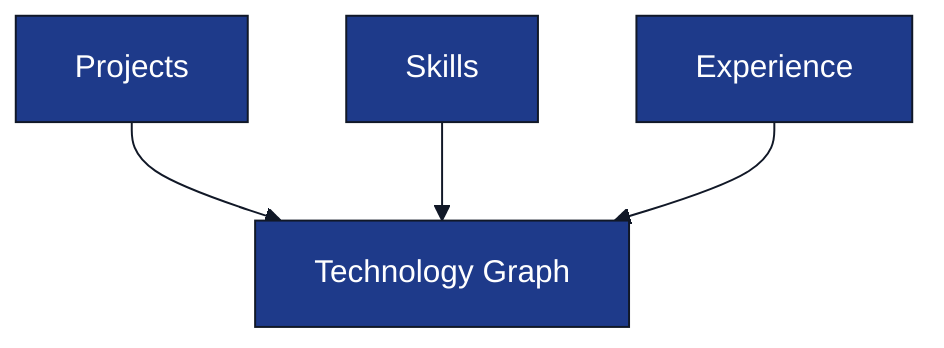

# Resume Intelligence Pipeline

**Project:** AI Interview Service

**Document:** `docs/tech-spec/05_resume_pipeline.md`

**Version:** 1.0 (LOCKED)

---

# Ownership

**This document owns:**

- Resume processing pipeline.
- Resume validation.
- Resume Intelligence generation.
- Technology Graph generation.
- Interview Topic generation.

**References**

- `02_architecture.md` → System architecture.
- `04_interview_engine.md` → Consumer of Resume Intelligence.
- `06_prompt_architecture.md` → Resume Parser prompt.
- `07_database_schema.md` → Resume persistence model.

---

# 1. Purpose

The Resume Pipeline converts an uploaded resume into **Resume Intelligence**, a structured representation used by the Interview Engine.

The pipeline executes **once per uploaded resume** before an interview starts.

---

# 2. Pipeline Overview

---

# 3. Pipeline Stages

| Stage | Responsibility |
|-------|----------------|
| Extract Text | Read text from uploaded PDF. |
| Normalize Resume | Remove formatting noise and normalize sections. |
| Resume Parser | Convert normalized text into structured JSON. |
| Validate JSON | Ensure required fields and schema correctness. |
| Resume Intelligence Builder | Generate interview topics and technology graph. |

---

# 4. Resume Validation

Validation happens after parsing.

### Required Sections

| Section | Required |
|---------|----------|
| Name | ✅ |
| Skills | ✅ |
| Projects | ✅ |
| Experience | Optional |
| Education | Optional |

### Validation Rules

- Empty projects are allowed.
- Empty experience is allowed.
- Missing required skills returns a validation error.
- Invalid parser output is retried once.

---

# 5. Resume Intelligence

Resume Intelligence is the output consumed by the Interview Engine.

### Generated Fields

| Field | Purpose |
|-------|---------|
| Candidate Profile | Basic candidate information. |
| Skills | Normalized skill list. |
| Projects | Parsed projects with technologies. |
| Experience | Parsed work experience. |
| Technology Graph | Technologies extracted from resume. |
| Interview Topics | Ordered interview topics. |

This object is stored in PostgreSQL.

---

# 6. Technology Graph Builder

The builder extracts technologies from projects, skills, and experience.

### Technology Node

Each technology contains:

- Name
- Category
- Confidence
- Resume references

---

# 7. Interview Topic Builder

Interview topics are generated from the Technology Graph.

### Priority Rules

1. Technologies used in projects.
2. Technologies used in work experience.
3. Core backend skills.
4. Supporting libraries and tools.

### Example

| Technology | Initial Priority |
|------------|------------------|
| Kafka | High |
| Redis | High |
| PostgreSQL | Medium |
| Docker | Medium |
| Git | Low |

Topics are ordered before interview initialization.

---

# 8. Resume Parser Output

The Resume Parser returns structured JSON.

### Output Contains

- Candidate details.
- Skills.
- Projects.
- Experience.
- Education.
- Certifications (optional).

The prompt contract is defined in `06_prompt_architecture.md`.

---

# 9. Error Handling

| Failure | Action |
|---------|--------|
| PDF extraction failed | Reject upload. |
| Invalid parser JSON | Retry parser once. |
| Validation failed | Return validation error. |
| Intelligence generation failed | Reject resume processing. |

The interview session is created only after successful Resume Intelligence generation.

---

# 10. Output Consumers

| Consumer | Uses |
|----------|------|
| Interview Engine | Interview topics and resume context. |
| PostgreSQL | Persist Resume Intelligence. |
| Final Evaluation | Resume metadata for reporting. |

Resume Intelligence becomes read-only after successful processing.

---

# 11. Related Documents

| Topic | Document |
|-------|----------|
| Interview Engine | `04_interview_engine.md` |
| Prompt Architecture | `06_prompt_architecture.md` |
| Database Schema | `07_database_schema.md` |