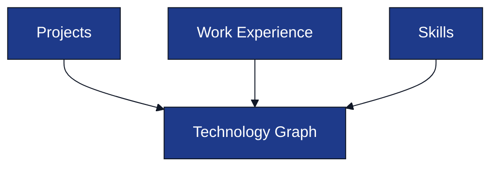

# Resume Intelligence Pipeline

**Project:** AI Interview Service

**Document:** `docs/tech-spec/05_resume_pipeline.md`

**Version:** 1.1 (LOCKED)

---

# Ownership

**This document owns:**

- Resume processing pipeline.
- Resume validation.
- Resume Intelligence generation.
- Technology Graph generation.
- Interview Context generation.

**References**

- `02_architecture.md` → System architecture.
- `04_interview_engine.md` → Consumer of Resume Intelligence.
- `06_prompt_architecture.md` → Resume Parser prompt contract.
- `07_database_schema.md` → Resume persistence model.

---

# 1. Purpose

The Resume Pipeline converts an uploaded resume into **Resume Intelligence**, a structured representation of the candidate's projects, work experience, technologies, and interview contexts.

This pipeline executes **once per uploaded resume** before an interview starts.

The Interview Engine never reads the raw resume. It consumes only the generated Resume Intelligence.

---

# 2. Pipeline Overview


---

# 3. Pipeline Stages

| Stage | Responsibility |
|-------|----------------|
| Extract Text | Extract text from uploaded PDF. |
| Normalize Resume | Remove formatting noise and normalize sections. |
| Resume Parser | Convert resume text into structured JSON. |
| Validate Resume JSON | Validate required fields and schema. |
| Technology Graph Builder | Extract unique technologies and build the Technology Graph. |
| Interview Context Builder | Build project, experience, and skill contexts that reference Technology Graph topics. |
| Resume Intelligence Builder | Combine Technology Graph and Interview Contexts into a reusable Resume Intelligence object. |

---

# 4. Resume Validation

Validation happens immediately after Resume Parser output.

## Required Sections

| Section | Required |
|---------|----------|
| Name | ✅ |
| Skills | ✅ |
| Projects | ✅ |
| Experience | Optional |
| Education | Optional |

## Validation Rules

- Projects may be empty.
- Experience may be empty.
- Skills must exist.
- Invalid parser JSON is retried once.
- Resume processing stops if validation fails twice.

---

# 5. Resume Intelligence

Resume Intelligence is the only input used by the Interview Engine.

## Generated Fields

| Field | Purpose |
|-------|---------|
| Skills | Normalized candidate skills. |
| Projects | Parsed projects with descriptions and technologies. |
| Experience | Parsed work experience. |
| Technology Graph | Technology relationships extracted from resume. |
| Interview Contexts | Context-aware interview plan. |

Resume Intelligence is stored inside the `resumes` table.

---

# 6. Technology Graph Builder

The Technology Graph identifies technologies and where they were used.



## Technology Node

A Technology Graph contains one unique node for each technology detected in the resume.

| Field | Purpose |
|-------|---------|
| `topic_id` | Stable UUID for the technology. |
| `name` | Normalized technology name. |
| `category` | Backend, Database, AI, Cloud, DevOps, etc. |
| `confidence` | Confidence score from Resume Parser extraction. |
| `sources` | Context names where the technology appears. |

Example:

```json
{
  "topic_id": "uuid",
  "name": "Redis",
  "category": "Database",
  "confidence": 0.98,
  "sources": [
    "AI Interview Platform",
    "Backend Internship"
  ]
}
```

### Design Rules

- Every technology appears only once in the Technology Graph.
- Technologies are deduplicated across projects, experience, and skills.
- The Technology Graph never stores interview difficulty, evaluation scores, or interview progress.

---

# 7. Interview Context Builder

This stage converts the Technology Graph into **Interview Contexts**.

> The interview is driven by **where a technology was used**, not by isolated technologies.

## Context Types

| Context Type | Description |
|--------------|-------------|
| `PROJECT` | Candidate-built projects. |
| `EXPERIENCE` | Professional work experience or internship. |
| `SKILL` | Standalone skills not tied to a project or experience. |

## Context Priority

1. Projects.
2. Work Experience.
3. Standalone Skills.

Projects receive the highest interview priority because they provide the richest implementation context.

---

# 8. Interview Context Structure

Each Interview Context represents one project, work experience, or standalone skill.

A context references technologies from the Technology Graph using `topic_id`.

```json
{
  "context_id": "uuid",
  "context_type": "PROJECT",
  "context_name": "AI Interview Platform",
  "description": "Real-time AI mock interview platform.",
  "priority": 1,
  "topic_ids": [
    "redis-topic-id",
    "websocket-topic-id",
    "postgres-topic-id",
    "gemini-topic-id"
  ]
}
```

### Design Rules

- Contexts reference technologies using `topic_ids`.
- A technology may belong to multiple contexts.
- Contexts do not store interview difficulty or evaluation state.
- Interview difficulty is determined at runtime by the Interview Engine.

---

# 9. Interview Planning Rules

The Interview Context Builder generates the interview plan before the interview starts.


## Planning Rules

- Group technologies by project, work experience, or standalone skill.
- Preserve the relationship between technologies and their implementation context.
- Generate a stable `topic_id` for each unique technology.
- Generate a stable `context_id` for each interview context.
- Assign interview priority to each context.
- Do not assign interview difficulty during Resume Intelligence generation.

The Interview Engine generates runtime interview progression using Resume Intelligence without modifying the stored structure.

---


# 10. Practical Question Philosophy

Resume Intelligence prepares the Interview Engine for **scenario-based interviews**, not resume-reading questions.

## Question Style

| Context | Expected Question Style |
|--------|--------------------------|
| Project | Implementation, debugging, scaling, failures, trade-offs. |
| Work Experience | Ownership, production incidents, architecture decisions. |
| Standalone Skill | Practical concepts and applied scenarios. |

### Example

Instead of:

> Why did you use Redis?

The Interview Engine receives enough context to ask:

> What happens if Redis experiences a large number of cache misses while thousands of interview sessions are active?

This behavior is implemented in the Interview Engine and Prompt Architecture.

---

# 11. Resume Parser Output

The Resume Parser returns structured JSON containing:

- Skills.
- Projects.
- Experience.
- Education.
- Certifications (optional).

The parser **does not** generate interview questions or scores.

Prompt details are defined in `06_prompt_architecture.md`.

---

# 12. Error Handling

| Failure | Action |
|---------|--------|
| PDF extraction failed | Reject upload. |
| Invalid parser JSON | Retry parser once. |
| Validation failed | Return validation error. |
| Technology graph generation failed | Reject resume processing. |
| Interview context generation failed | Reject resume processing. |

Interview creation is allowed only after successful Resume Intelligence generation.

---

# 13. Output Consumers

| Consumer | Uses |
|----------|------|
| Interview Engine | Technology Graph, Interview Contexts, and resume metadata. |
| PostgreSQL | Persist Resume Intelligence and parsed resume metadata. |
| Evaluation Engine | Resume metadata for the final interview report. |

Resume Intelligence becomes read-only after successful processing.

Resume Intelligence becomes read-only after successful processing.

The Interview Engine reads Resume Intelligence from PostgreSQL during interview initialization, creates runtime interview state in Redis, and never modifies the stored Resume Intelligence.

---

# 14. Related Documents

| Topic | Document |
|-------|----------|
| Interview Engine | `04_interview_engine.md` |
| Prompt Architecture | `06_prompt_architecture.md` |
| Database Schema | `07_database_schema.md` |