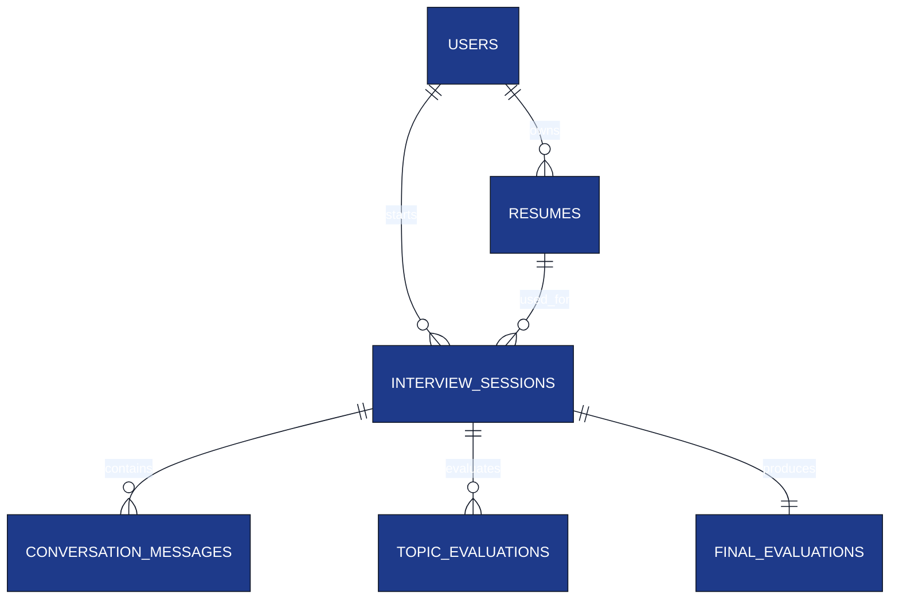

# Database Schema

**Project:** AI Interview Service

**Document:** `docs/tech-spec/07_database_schema.md`

**Version:** 1.1 (LOCKED)

---

# Ownership

**This document owns:**

- PostgreSQL schema.
- Entity relationships.
- Table definitions.
- Indexes and constraints.
- Persistence rules.

**References**

- `05_resume_pipeline.md` → Resume Intelligence generation.
- `04_interview_engine.md` → Interview lifecycle.
- `08_redis_strategy.md` → Runtime interview state.
- `11_auth_security.md` → Supabase authentication.

---

# 1. Database Design Principles

- PostgreSQL is the **source of truth**.
- UUID is the primary key for every table.
- Runtime interview state is stored only in Redis.
- `JSONB` is used only for flexible nested structures.
- Authentication is handled by Supabase Auth.

---

# 2. Entity Relationship Diagram



---

# 3. Tables Overview

| Table | Purpose |
|-------|---------|
| `users` | Candidate accounts (Supabase linked). |
| `resumes` | Resume metadata and Resume Intelligence. |
| `interview_sessions` | Interview session metadata. |
| `conversation_messages` | Complete interview transcript. |
| `topic_evaluations` | Evaluation for each interview topic. |
| `final_evaluations` | Final interview report. |

---

# 4. users

| Column | Type | Notes |
|--------|------|------|
| `id` | UUID | Primary Key |
| `supabase_user_id` | UUID | Unique Supabase user ID |
| `name` | VARCHAR(150) | Candidate name |
| `email` | VARCHAR(255) | Unique |
| `created_at` | TIMESTAMP | Creation time |
| `updated_at` | TIMESTAMP | Last update |

### Constraints

- PK → `id`
- Unique → `email`
- Unique → `supabase_user_id`

Passwords are managed entirely by Supabase.

---

# 5. resumes

Stores both resume metadata and Resume Intelligence.

| Column | Type | Notes |
|--------|------|------|
| `id` | UUID | Primary Key |
| `user_id` | UUID | FK → users |
| `file_name` | VARCHAR(255) | Uploaded filename |
| `status` | VARCHAR(30) | `PROCESSING`, `READY`, `FAILED` |
| `skills` | JSONB | Normalized skills |
| `projects` | JSONB | Parsed projects |
| `experience` | JSONB | Parsed experience |
| `technology_graph` | JSONB | Technologies extracted from resume |
| `interview_topics` | JSONB | Context-aware interview plan |
| `created_at` | TIMESTAMP | Upload time |
| `updated_at` | TIMESTAMP | Processing completion time |

### Interview Topics Structure

The Resume Pipeline generates **Interview Contexts** instead of standalone topics.

```json
[
  {
    "context_id": "ctx-uuid",
    "context_type": "PROJECT",
    "context_name": "AI Interview Platform",
    "context_priority": 1,

    "topic_id": "topic-uuid",
    "topic_name": "Redis",
    "difficulty": "MEDIUM",

    "source": {
      "project_name": "AI Interview Platform",
      "project_description": "Real-time AI interview platform."
    }
  }
]
```

### Notes

- Raw PDF is processed once and discarded.
- Resume Intelligence is stored in this table.

---

# 6. interview_sessions

| Column | Type | Notes |
|--------|------|------|
| `id` | UUID | Primary Key |
| `user_id` | UUID | FK → users |
| `resume_id` | UUID | FK → resumes |
| `status` | VARCHAR(30) | `ACTIVE`, `COMPLETED`, `ABANDONED` |
| `started_at` | TIMESTAMP | Interview start |
| `ended_at` | TIMESTAMP | Interview completion |
| `created_at` | TIMESTAMP | Record creation |

### Session Rules

- One resume can have multiple interview sessions.
- Runtime state exists only while the session is active.

---

# 7. conversation_messages

Stores the permanent interview transcript.

| Column | Type | Notes |
|--------|------|------|
| `id` | UUID | Primary Key |
| `session_id` | UUID | FK → interview_sessions |
| `sender` | VARCHAR(20) | `INTERVIEWER`, `CANDIDATE`, `SYSTEM` |
| `message_type` | VARCHAR(30) | `QUESTION`, `ANSWER`, `FOLLOW_UP`, `HINT`, `CLARIFICATION`, `SYSTEM` |
| `topic_id` | UUID | Active technology during the message |
| `scenario_type` | VARCHAR(30) | Interview scenario for this question |
| `content` | TEXT | Message text |
| `created_at` | TIMESTAMP | Message timestamp |

### Allowed Scenario Types

- `IMPLEMENTATION`
- `DEBUGGING`
- `FAILURE`
- `SCALING`
- `PERFORMANCE`
- `CONCURRENCY`
- `TRADE_OFF`
- `BEHAVIORAL`

### Why store `scenario_type`?

It allows replaying the interview flow and generating analytics such as strengths in debugging vs scaling questions.

---

# 8. topic_evaluations

Stores evaluation after a topic is completed.

| Column | Type | Notes |
|--------|------|------|
| `id` | UUID | Primary Key |
| `session_id` | UUID | FK → interview_sessions |
| `topic_id` | UUID | Topic being evaluated |
| `difficulty_level` | VARCHAR(20) | `EASY`, `MEDIUM`, `HARD` |
| `technical_score` | SMALLINT | 1–5 |
| `depth_score` | SMALLINT | 1–5 |
| `reasoning_score` | SMALLINT | 1–5 |
| `communication_score` | SMALLINT | 1–5 |
| `scenarios_covered` | JSONB | Scenario types discussed for this topic |
| `strengths` | JSONB | Strong concepts demonstrated |
| `weaknesses` | JSONB | Missing or incorrect concepts |
| `created_at` | TIMESTAMP | Evaluation timestamp |

### Example `scenarios_covered`

```json
[
  "IMPLEMENTATION",
  "FAILURE",
  "SCALING"
]
```

### Constraints

Unique evaluation per topic per interview session.

```text
(session_id, topic_id)
```

---

# 9. final_evaluations

| Column | Type | Notes |
|--------|------|------|
| `id` | UUID | Primary Key |
| `session_id` | UUID | FK → interview_sessions |
| `overall_score` | SMALLINT | 0–100 |
| `recommendation` | VARCHAR(30) | `STRONG_HIRE`, `HIRE`, `HOLD`, `NO_HIRE` |
| `strengths` | JSONB | Overall strengths |
| `weaknesses` | JSONB | Overall weaknesses |
| `learning_recommendations` | JSONB | Suggested improvement topics |
| `created_at` | TIMESTAMP | Report generation time |

### Constraints

One final evaluation per interview session.

```text
session_id
```

---

# 10. Index Strategy

| Table | Index |
|-------|-------|
| `users` | `email`, `supabase_user_id` |
| `resumes` | `user_id`, `status` |
| `interview_sessions` | `(user_id, status)`, `resume_id` |
| `conversation_messages` | `(session_id, created_at)` |
| `topic_evaluations` | `(session_id, topic_id)` |
| `final_evaluations` | `session_id` (unique) |

---

# 11. Constraints

| Constraint | Purpose |
|------------|---------|
| UUID Primary Keys | Globally unique identifiers. |
| Foreign Keys | Referential integrity. |
| Unique Email | One account per email. |
| Unique Supabase User ID | One auth identity per user. |
| One Topic Evaluation | `(session_id, topic_id)` |
| One Final Evaluation | `session_id` |

---

# 12. Persistence Rules

| Data | Stored In |
|------|-----------|
| User profile | PostgreSQL |
| Resume Intelligence | PostgreSQL (`resumes`) |
| Interview transcript | PostgreSQL |
| Topic evaluations | PostgreSQL |
| Final evaluation | PostgreSQL |
| Runtime interview state | Redis |

Redis never stores permanent interview history.

---

# 13. JSONB Usage Policy

| Column | Reason |
|--------|--------|
| `skills` | Variable skill list. |
| `projects` | Nested project objects. |
| `experience` | Variable experience entries. |
| `technology_graph` | Technology relationships. |
| `interview_topics` | Context → Topic hierarchy. |
| `scenarios_covered` | Variable scenario list per topic. |
| `strengths` | Dynamic list of strengths. |
| `weaknesses` | Dynamic list of weaknesses. |
| `learning_recommendations` | Dynamic recommendations. |

Fixed evaluation metrics remain typed SQL columns.

---

# 14. Related Documents

| Topic | Document |
|-------|----------|
| Resume Pipeline | `05_resume_pipeline.md` |
| Interview Engine | `04_interview_engine.md` |
| Redis Strategy | `08_redis_strategy.md` |
| Evaluation Engine | `12_evaluation_engine.md` |
| Authentication | `11_auth_security.md` |