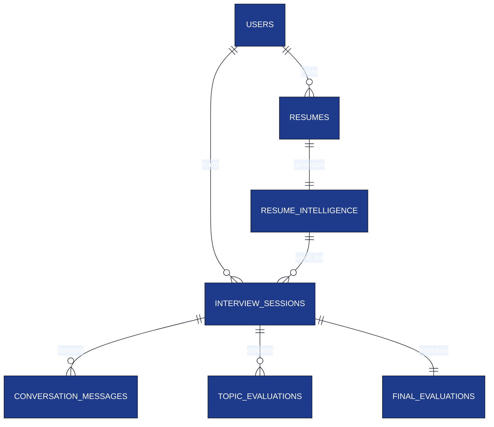

# Database Schema

**Project:** AI Interview Service

**Document:** `docs/tech-spec/07_database_schema.md`

**Version:** 1.0 (LOCKED)

---

# Ownership

**This document owns:**

- PostgreSQL schema.
- Entity relationships.
- Table definitions.
- Indexes and constraints.
- Persistence rules.

**References**

- `05_resume_pipeline.md` → Resume Intelligence generation.
- `04_interview_engine.md` → Session lifecycle.
- `08_redis_strategy.md` → Runtime state stored outside PostgreSQL.

---

# 1. Database Design Principles

### Core Principles

- PostgreSQL is the **source of truth**.
- UUID is the primary key for every entity.
- Normalize entities where relationships exist.
- Use `JSONB` only for flexible structured data.
- Runtime interview state is **never** stored here.

---

# 2. Entity Relationship Diagram



---

# 3. Tables Overview

| Table | Purpose |
|-------|---------|
| `users` | Candidate accounts. |
| `resumes` | Uploaded resume metadata. |
| `resume_intelligence` | Parsed resume JSON and interview topics. |
| `interview_sessions` | Interview session metadata. |
| `conversation_messages` | Complete interview conversation. |
| `topic_evaluations` | Evaluation for each interview topic. |
| `final_evaluations` | Final interview report. |

---

# 4. users

Stores candidate information.

| Column | Type | Notes |
|--------|------|------|
| `id` | UUID | Primary Key |
| `name` | VARCHAR(150) | Candidate name |
| `email` | VARCHAR(255) | Unique |
| `password_hash` | TEXT | bcrypt hash |
| `created_at` | TIMESTAMP | Creation time |
| `updated_at` | TIMESTAMP | Last update |

### Constraints

- Primary Key → `id`
- Unique → `email`

---

# 5. resumes

Stores uploaded resume metadata.

| Column | Type | Notes |
|--------|------|------|
| `id` | UUID | Primary Key |
| `user_id` | UUID | FK → users |
| `file_name` | VARCHAR(255) | Original filename |
| `status` | VARCHAR(30) | `PROCESSING`, `READY`, `FAILED` |
| `created_at` | TIMESTAMP | Upload time |
| `updated_at` | TIMESTAMP | Processing completion |

### Notes

- Raw PDF is processed during parsing.
- V1 does **not** permanently store the PDF.

---

# 6. resume_intelligence

Stores the parsed resume used by the Interview Engine.

| Column | Type | Notes |
|--------|------|------|
| `id` | UUID | Primary Key |
| `resume_id` | UUID | FK → resumes |
| `candidate_profile` | JSONB | Basic candidate info |
| `skills` | JSONB | Normalized skills |
| `projects` | JSONB | Parsed projects |
| `experience` | JSONB | Parsed work experience |
| `technology_graph` | JSONB | Technologies extracted |
| `interview_topics` | JSONB | Ordered interview topics |
| `created_at` | TIMESTAMP | Generation time |

### Why JSONB?

Resume structure varies between candidates, so flexible structured storage is preferred.

---

# 7. interview_sessions

Represents one interview attempt.

| Column | Type | Notes |
|--------|------|------|
| `id` | UUID | Primary Key |
| `user_id` | UUID | FK → users |
| `resume_intelligence_id` | UUID | FK → resume_intelligence |
| `status` | VARCHAR(30) | `ACTIVE`, `COMPLETED`, `ABANDONED` |
| `started_at` | TIMESTAMP | Interview start |
| `ended_at` | TIMESTAMP | Interview end |
| `duration_seconds` | INTEGER | Total interview duration |
| `created_at` | TIMESTAMP | Record creation |

### Session Rules

- One resume intelligence can be reused across multiple interview sessions.
- Every interview session has exactly one final evaluation.

---

# 8. conversation_messages

Stores the complete interview conversation.

| Column | Type | Notes |
|--------|------|------|
| `id` | UUID | Primary Key |
| `session_id` | UUID | FK → interview_sessions |
| `sender` | VARCHAR(20) | `INTERVIEWER` / `CANDIDATE` |
| `message_type` | VARCHAR(30) | `QUESTION`, `ANSWER`, `HINT`, `CLARIFICATION`, `SYSTEM` |
| `topic_name` | VARCHAR(100) | Active topic when message was generated |
| `content` | TEXT | Message text |
| `created_at` | TIMESTAMP | Message timestamp |

### Notes

Speech is converted to text before storage.

---

# 9. topic_evaluations

Stores evaluation after each topic completes.

| Column | Type | Notes |
|--------|------|------|
| `id` | UUID | Primary Key |
| `session_id` | UUID | FK → interview_sessions |
| `topic_name` | VARCHAR(100) | Topic evaluated |
| `difficulty_level` | VARCHAR(20) | EASY / MEDIUM / HARD |
| `technical_score` | SMALLINT | 1–5 |
| `depth_score` | SMALLINT | 1–5 |
| `reasoning_score` | SMALLINT | 1–5 |
| `communication_score` | SMALLINT | 1–5 |
| `strengths` | JSONB | Strong concepts |
| `weaknesses` | JSONB | Missing concepts |
| `created_at` | TIMESTAMP | Evaluation timestamp |

### Constraints

- One topic evaluation per topic per session.

Unique Key:

```
(session_id, topic_name)
```

---

# 10. final_evaluations

Stores the final interview report.

| Column | Type | Notes |
|--------|------|------|
| `id` | UUID | Primary Key |
| `session_id` | UUID | FK → interview_sessions |
| `overall_score` | SMALLINT | 0–100 |
| `recommendation` | VARCHAR(30) | Hire recommendation |
| `strengths` | JSONB | Overall strengths |
| `weaknesses` | JSONB | Overall weaknesses |
| `learning_recommendations` | JSONB | Suggested learning topics |
| `created_at` | TIMESTAMP | Report generation |

### Constraints

- One final evaluation per interview session.

Unique Key:

```
session_id
```

---

# 11. Index Strategy

| Table | Index |
|-------|-------|
| `users` | `email` (unique) |
| `resumes` | `user_id` |
| `resume_intelligence` | `resume_id` |
| `interview_sessions` | `user_id`, `status` |
| `conversation_messages` | `(session_id, created_at)` |
| `topic_evaluations` | `(session_id, topic_name)` |
| `final_evaluations` | `session_id` (unique) |

These indexes support the interview APIs and reporting queries.

---

# 12. Constraints

| Constraint | Purpose |
|------------|---------|
| Foreign Keys | Maintain referential integrity. |
| UUID Primary Keys | Globally unique identifiers. |
| Unique Email | One account per email. |
| Unique Session Evaluation | One final evaluation per session. |
| Unique Topic Evaluation | One evaluation per topic per session. |

---

# 13. Persistence Rules

| Data | Stored In |
|------|-----------|
| User profile | PostgreSQL |
| Resume metadata | PostgreSQL |
| Resume Intelligence | PostgreSQL |
| Interview conversation | PostgreSQL |
| Topic evaluations | PostgreSQL |
| Final evaluation | PostgreSQL |
| Runtime interview state | Redis |

Redis is never the source of truth.

---

# 14. Related Documents

| Topic | Document |
|-------|----------|
| Resume Pipeline | `05_resume_pipeline.md` |
| Interview Engine | `04_interview_engine.md` |
| Redis Runtime State | `08_redis_strategy.md` |
| Evaluation Engine | `12_evaluation_engine.md` |