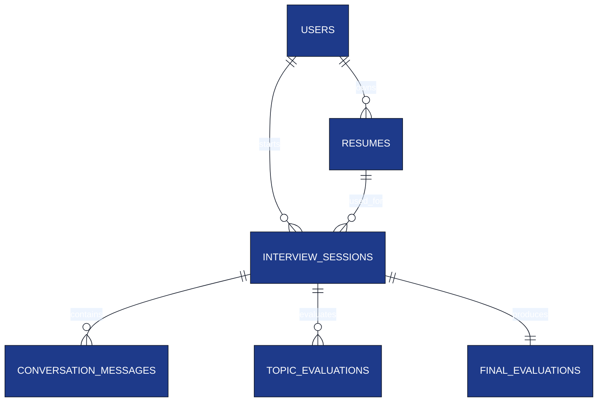

# Database Schema

**Project:** AI Interview Service

**Document:** `docs/tech-spec/07_database_schema.md`

**Version:** 1.0 (LOCKED)

---

# Ownership

**This document owns:**

- PostgreSQL schema.
- Entity relationships.
- Table definitions.
- Indexes and constraints.
- Persistence rules.

**References**

- `05_resume_pipeline.md` → Resume Intelligence generation.
- `04_interview_engine.md` → Interview session lifecycle.
- `08_redis_strategy.md` → Runtime state stored in Redis.
- `11_auth_security.md` → Supabase authentication integration.

---

# 1. Database Design Principles

### Core Principles

- PostgreSQL is the **source of truth**.
- UUID is the primary key for every table.
- Runtime interview state is **never** stored in PostgreSQL.
- Use `JSONB` only for flexible nested structures.
- Authentication is handled by **Supabase Auth**.

---

# 2. Entity Relationship Diagram



---

# 3. Tables Overview

| Table | Purpose |
|-------|---------|
| `users` | Candidate accounts (linked with Supabase). |
| `resumes` | Resume metadata + Resume Intelligence. |
| `interview_sessions` | Interview session metadata. |
| `conversation_messages` | Complete interview transcript. |
| `topic_evaluations` | Per-topic evaluation scores. |
| `final_evaluations` | Final interview report. |

---

# 4. users

Stores application users mapped to Supabase Auth.

| Column | Type | Notes |
|--------|------|------|
| `id` | UUID | Primary Key |
| `supabase_user_id` | UUID | Unique user ID from Supabase |
| `name` | VARCHAR(150) | Candidate display name |
| `email` | VARCHAR(255) | Unique |
| `created_at` | TIMESTAMP | Creation time |
| `updated_at` | TIMESTAMP | Last update |

### Constraints

- Primary Key → `id`
- Unique → `email`
- Unique → `supabase_user_id`

### Notes

- Passwords are **never stored** in this database.
- JWT verification is handled using Supabase public keys.

---

# 5. resumes

Stores processed resume data used during interviews.

| Column | Type | Notes |
|--------|------|------|
| `id` | UUID | Primary Key |
| `user_id` | UUID | FK → users |
| `file_name` | VARCHAR(255) | Original uploaded filename |
| `status` | VARCHAR(30) | `PROCESSING`, `READY`, `FAILED` |
| `skills` | JSONB | Normalized skills |
| `projects` | JSONB | Parsed projects |
| `experience` | JSONB | Parsed experience |
| `technology_graph` | JSONB | Technology graph generated from resume |
| `interview_topics` | JSONB | Ordered interview topics with IDs |
| `created_at` | TIMESTAMP | Upload time |
| `updated_at` | TIMESTAMP | Processing completion time |

### Why JSONB here?

Resume structure differs for every candidate, so nested JSON is appropriate.

### Interview Topic Structure

Each topic generated by the Resume Pipeline includes a stable UUID.

```json
[
  {
    "topic_id": "uuid",
    "name": "Redis",
    "priority": 1,
    "difficulty": "MEDIUM",
    "source": "project"
  }
]
```

### Notes

- Raw PDF is processed once and discarded.
- This table already contains **Resume Intelligence**, so no separate table is needed.

---

# 6. interview_sessions

Represents one interview attempt.

| Column | Type | Notes |
|--------|------|------|
| `id` | UUID | Primary Key |
| `user_id` | UUID | FK → users |
| `resume_id` | UUID | FK → resumes |
| `status` | VARCHAR(30) | `ACTIVE`, `COMPLETED`, `ABANDONED` |
| `started_at` | TIMESTAMP | Interview start |
| `ended_at` | TIMESTAMP | Interview completion |
| `created_at` | TIMESTAMP | Record creation |

### Session Rules

- One resume can be reused for multiple interview sessions.
- Runtime state exists only while status is `ACTIVE`.

---

# 7. conversation_messages

Stores the complete interview transcript.

| Column | Type | Notes |
|--------|------|------|
| `id` | UUID | Primary Key |
| `session_id` | UUID | FK → interview_sessions |
| `sender` | VARCHAR(20) | `INTERVIEWER`, `CANDIDATE`, `SYSTEM` |
| `message_type` | VARCHAR(30) | `QUESTION`, `ANSWER`, `FOLLOW_UP`, `HINT`, `CLARIFICATION`, `SYSTEM` |
| `topic_id` | UUID | Topic active during this message |
| `content` | TEXT | Text message |
| `created_at` | TIMESTAMP | Message timestamp |

### Why store `topic_id`?

- Stable identifier throughout the interview.
- Avoids string comparisons (`Kafka` vs `Apache Kafka`).
- Matches Interview Engine runtime state.

### Notes

Speech is converted to text on the frontend before storage.

---

# 8. topic_evaluations

Stores evaluation after a topic is completed.

| Column | Type | Notes |
|--------|------|------|
| `id` | UUID | Primary Key |
| `session_id` | UUID | FK → interview_sessions |
| `topic_id` | UUID | Resume topic UUID |
| `difficulty_level` | VARCHAR(20) | `EASY`, `MEDIUM`, `HARD` |
| `technical_score` | SMALLINT | 1–5 |
| `depth_score` | SMALLINT | 1–5 |
| `reasoning_score` | SMALLINT | 1–5 |
| `communication_score` | SMALLINT | 1–5 |
| `strengths` | JSONB | Strong concepts discussed |
| `weaknesses` | JSONB | Missing or incorrect concepts |
| `created_at` | TIMESTAMP | Evaluation timestamp |

### Why separate score columns?

Scores are fixed metrics used for filtering and analytics, so typed columns are better than JSON.

### Constraints

Unique topic evaluation per interview session.

```text
(session_id, topic_id)
```

---

# 9. final_evaluations

Stores the final interview report.

| Column | Type | Notes |
|--------|------|------|
| `id` | UUID | Primary Key |
| `session_id` | UUID | FK → interview_sessions |
| `overall_score` | SMALLINT | 0–100 |
| `recommendation` | VARCHAR(30) | `STRONG_HIRE`, `HIRE`, `HOLD`, `NO_HIRE` |
| `strengths` | JSONB | Overall strengths |
| `weaknesses` | JSONB | Overall weaknesses |
| `learning_recommendations` | JSONB | Suggested improvement topics |
| `created_at` | TIMESTAMP | Report generation time |

### Constraints

One final evaluation per interview session.

Unique key:

```text
session_id
```

---

# 10. Index Strategy

| Table | Index |
|-------|-------|
| `users` | `email`, `supabase_user_id` |
| `resumes` | `user_id`, `status` |
| `interview_sessions` | `(user_id, status)`, `resume_id` |
| `conversation_messages` | `(session_id, created_at)` |
| `topic_evaluations` | `(session_id, topic_id)` |
| `final_evaluations` | `session_id` (unique) |

These indexes optimize interview history, replay, and evaluation APIs.

---

# 11. Constraints

| Constraint | Purpose |
|------------|---------|
| UUID Primary Keys | Globally unique identifiers. |
| Foreign Keys | Referential integrity. |
| Unique Email | One account per email. |
| Unique Supabase User ID | One application user per auth user. |
| One Topic Evaluation | `(session_id, topic_id)` |
| One Final Evaluation | `session_id` |

---

# 12. Persistence Rules

| Data | Stored In |
|------|-----------|
| User profile | PostgreSQL |
| Resume metadata | PostgreSQL |
| Resume Intelligence | PostgreSQL (`resumes` table) |
| Interview transcript | PostgreSQL |
| Topic evaluations | PostgreSQL |
| Final evaluation | PostgreSQL |
| Active interview state | Redis |

Redis never stores permanent interview history.

---

# 13. JSONB Usage Policy

Use `JSONB` only for flexible nested structures.

| Column | Why JSONB? |
|--------|------------|
| `skills` | Variable skill list. |
| `projects` | Nested project objects. |
| `experience` | Variable experience entries. |
| `technology_graph` | Graph nodes and metadata. |
| `interview_topics` | Ordered topic objects with IDs. |
| `strengths` | List of strengths. |
| `weaknesses` | List of weaknesses. |
| `learning_recommendations` | Variable recommendation list. |

All scoring fields remain typed SQL columns.

---

# 14. Related Documents

| Topic | Document |
|-------|----------|
| Resume Pipeline | `05_resume_pipeline.md` |
| Interview Engine | `04_interview_engine.md` |
| Redis Runtime State | `08_redis_strategy.md` |
| Evaluation Engine | `12_evaluation_engine.md` |
| Authentication | `11_auth_security.md` |