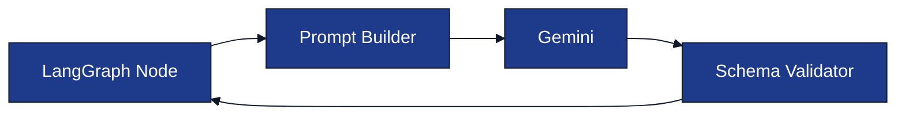

# Prompt Architecture

**Project:** AI Interview Service

**Document:** `docs/tech-spec/06_prompt_architecture.md`

**Version:** 1.1 (LOCKED)

---

# Ownership

**This document owns:**

- Prompt catalog.
- Prompt inputs and outputs.
- Prompt versioning.
- Prompt validation and retry rules.

**References**

- `04_interview_engine.md` → Prompt execution workflow.
- `05_resume_pipeline.md` → Resume Parser input.
- `03_folder_structure.md` → `internal/interview/engine/prompts/`.

---

# 1. Purpose

Every Gemini interaction happens through a **versioned prompt**.

Prompts are responsible only for **generating structured outputs**.

The Interview Engine decides:

- Current context.
- Current topic.
- Scenario type.
- Difficulty.
- Next workflow transition.

Prompts never control interview state.

---

# 2. Prompt Organization

All prompt templates live inside:

```text
internal/interview/engine/prompts/
│
├── builder.go
├── loader.go
├── registry.go
├── resume_parser_v1.txt
├── intent_detector_v1.txt
├── guardrail_detector_v1.txt
├── technical_question_v1.txt
├── technical_evaluator_v1.txt
├── followup_generator_v1.txt
├── clarification_generator_v1.txt
├── hint_generator_v1.txt
├── thinking_prompt_v1.txt
├── behavioral_generator_v1.txt
└── final_evaluation_v1.txt
```

| File | Responsibility |
|------|----------------|
| `builder.go` | Builds runtime prompt context. |
| `loader.go` | Loads prompt templates using `go:embed`. |
| `registry.go` | Maps prompt names to versions. |
| `*.txt` | Versioned prompt templates. |

---

# 3. Prompt Versioning

Each prompt is versioned independently.

| Prompt | Version |
|--------|---------|
| Resume Parser | `resume_parser_v1` |
| Intent Detector | `intent_detector_v1` |
| Guardrail Detector | `guardrail_detector_v1` |
| Technical Question | `technical_question_v1` |
| Technical Evaluator | `technical_evaluator_v1` |
| Follow-up Generator | `followup_generator_v1` |
| Clarification Generator | `clarification_generator_v1` |
| Hint Generator | `hint_generator_v1` |
| Thinking Prompt | `thinking_prompt_v1` |
| Behavioral Generator | `behavioral_generator_v1` |
| Final Evaluation | `final_evaluation_v1` |

A new prompt behavior creates `v2`; existing versions remain unchanged.

---

# 4. Prompt Execution Flow



Every LangGraph node executes **exactly one prompt**.

---

# 5. Shared Prompt Context

Prompt Builder injects runtime context before execution.

| Context | Source |
|--------|--------|
| Resume Context | Resume Intelligence |
| Current Context | Interview Engine |
| Current Topic | Interview Engine |
| Scenario Type | Interview Engine |
| Difficulty Level | Interview Engine |
| Candidate Message | WebSocket |
| Candidate Memory Summary | Redis |

Prompts remain stateless.

---

# 6. Prompt Catalog

| Prompt | Used By |
|--------|---------|
| Resume Parser | Resume Pipeline |
| Intent Detector | `DetectCandidateIntent` |
| Guardrail Detector | `GuardrailCheck` |
| Technical Question | `GenerateQuestion` |
| Technical Evaluator | `AnalyzeTechnicalAnswer` |
| Follow-up Generator | `GenerateFollowUp` |
| Clarification Generator | `GenerateClarification` |
| Hint Generator | `GenerateHint` |
| Thinking Prompt | `GenerateThinkingResponse` |
| Behavioral Generator | `BehavioralDiscussion` |
| Final Evaluation | `GenerateFinalEvaluation` |

---

# 7. Resume Parser Prompt

### Purpose

Convert normalized resume text into structured resume JSON.

### Input

- Normalized resume text.

### Output

- Skills.
- Projects.
- Experience.
- Education.
- Certifications (optional).

Used only during Resume Pipeline execution.

---

# 8. Technical Question Prompt

### Purpose

Generate one interview question for the current interview state.

### Input

| Field | Description |
|------|-------------|
| Context | Project, experience, or skill. |
| Topic | Technology currently being discussed. |
| Scenario | Implementation, debugging, scaling, etc. |
| Difficulty | EASY / MEDIUM / HARD. |
| Candidate Memory | Previous discussion summary. |

### Output

| Field | Description |
|------|-------------|
| `question` | Interview question text. |
| `expected_focus` | Concepts expected in the answer. |

## Question Generation Rules

Generate **practical interview questions** based on resume context.

Prefer:

- Production scenarios.
- Debugging.
- Failures.
- Scaling.
- Trade-offs.
- Concurrency.
- Performance.

Avoid:

- Definitions.
- "Why did you use X?"
- Resume-reading questions.
- Generic textbook questions.

### Example

**Input**

- Context → AI Interview Platform
- Topic → Redis
- Scenario → FAILURE
- Difficulty → HARD

**Output Question**

> What happens if Redis becomes unavailable while active interview sessions are stored in memory? How would you recover the session without losing candidate progress?

---

# 9. Intent Detector Prompt

### Purpose

Classify the candidate's latest message.

### Output

| Field | Description |
|------|-------------|
| `intent` | Candidate intent. |
| `confidence` | Confidence score. |

### Allowed Intents

- ANSWER
- REQUEST_CLARIFICATION
- ASK_HINT
- THINKING_OUT_LOUD
- OFF_TOPIC
- PROMPT_INJECTION
- END_REQUEST

---

# 10. Guardrail Detector Prompt

### Purpose

Detect unsupported or malicious requests.

### Output

| Field | Description |
|------|-------------|
| `is_safe` | Safe to continue interview. |
| `category` | Detection category. |

### Categories

- NORMAL
- OFF_TOPIC
- PROMPT_INJECTION
- UNSUPPORTED

---

# 11. Technical Evaluator Prompt

### Purpose

Evaluate one technical answer for the active topic.

### Output

| Field | Description |
|------|-------------|
| `technical_score` | Technical correctness. |
| `depth_score` | Depth of understanding. |
| `reasoning_score` | Problem-solving quality. |
| `communication_score` | Communication quality. |
| `strengths` | Correct concepts demonstrated. |
| `weaknesses` | Missing or incorrect concepts. |
| `follow_up_required` | Whether another question is needed. |

This output is consumed by the Interview Engine.

---

# 12. Conversation Prompts

| Prompt | Purpose |
|--------|---------|
| Clarification | Rephrase the current question. |
| Hint | Provide a directional hint without revealing the answer. |
| Thinking Prompt | Encourage reasoning and explanation. |
| Follow-up Generator | Generate a deeper question within the same context and topic. |
| Behavioral Generator | Generate behavioral questions using resume context. |

These prompts never modify interview state.

---

# 13. Final Evaluation Prompt

### Purpose

Generate the final interview report after interview completion.

### Output

| Field | Description |
|------|-------------|
| `overall_score` | Overall interview score (0–100). |
| `strengths` | Overall strengths. |
| `weaknesses` | Overall weaknesses. |
| `recommendation` | Hire recommendation. |
| `learning_recommendations` | Suggested improvement topics. |

---

# 14. Output Validation

Every prompt response is validated before use.

| Validation | Action |
|-----------|--------|
| Invalid JSON | Retry once. |
| Missing required fields | Retry once. |
| Invalid enum value | Reject response. |
| Empty response | Retry once. |

Interview state is never updated using invalid prompt output.

---

# 15. Retry Strategy

| Failure | Retry |
|--------|-------|
| Invalid JSON | 1 |
| Empty response | 1 |
| Timeout | 1 |
| Schema validation failure | 1 |

If retry fails, the Interview Engine returns a safe fallback response.

---

# 16. Prompt Design Rules

- One prompt performs one responsibility.
- Prompts always return structured JSON.
- Prompts never decide interview workflow.
- Prompts never access Redis or PostgreSQL.
- Prompt templates remain immutable within the same version.

---

# 17. Related Documents

| Topic | Document |
|-------|----------|
| Interview Engine | `04_interview_engine.md` |
| Resume Pipeline | `05_resume_pipeline.md` |
| Evaluation Engine | `12_evaluation_engine.md` |