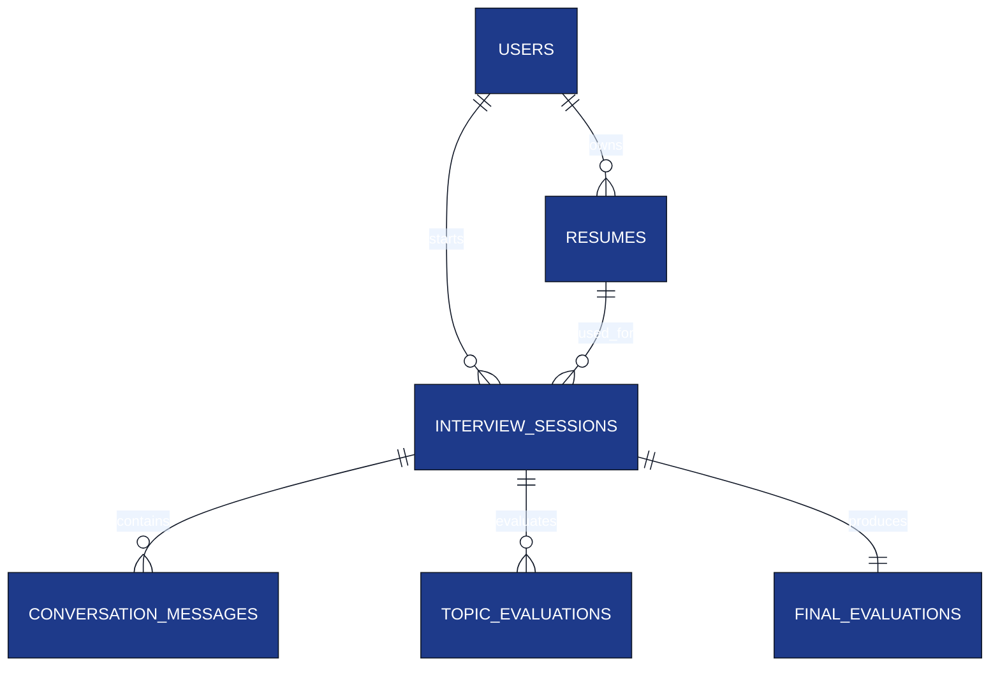

# Database Schema

**Project:** AI Interview Service

**Document:** `docs/tech-spec/07_database_schema.md`

**Version:** 1.2 (LOCKED)

---

# Ownership

**This document owns:**

- PostgreSQL schema.
- Entity relationships.
- Table definitions.
- Indexes and constraints.
- Persistence rules.

**References**

- `05_resume_pipeline.md` → Resume Intelligence generation.
- `04_interview_engine.md` → Interview lifecycle.
- `08_redis_strategy.md` → Runtime interview state.
- `11_auth_security.md` → Supabase authentication.

---

# 1. Database Design Principles

### Core Principles

- PostgreSQL is the **source of truth**.
- UUID is the primary key for every table.
- Runtime interview state lives only in Redis.
- Use `JSONB` only for flexible nested structures.
- Authentication is handled by **Supabase Auth**.
- Resume Intelligence is stored once per resume.

---

# 2. Entity Relationship Diagram



---

# 3. Tables Overview

| Table | Purpose |
|-------|---------|
| `users` | Candidate accounts linked with Supabase Auth. |
| `resumes` | Resume metadata and Resume Intelligence. |
| `interview_sessions` | Metadata for each interview attempt. |
| `conversation_messages` | Permanent interview transcript. |
| `topic_evaluations` | Evaluation for each technology discussed. |
| `final_evaluations` | Overall interview report. |

---

# 4. users

Stores application users.

| Column | Type | Notes |
|--------|------|------|
| `id` | UUID | Primary Key |
| `supabase_user_id` | UUID | Unique Supabase user identifier |
| `name` | VARCHAR(150) | Candidate name |
| `email` | VARCHAR(255) | Unique email |
| `created_at` | TIMESTAMP | Creation time |
| `updated_at` | TIMESTAMP | Last update |

- `supabase_user_id` references the authenticated user in `auth.users`.
- `id` is the application's internal UUID used throughout business tables.

### Constraints

- Primary Key → `id`
- Unique → `email`
- Unique → `supabase_user_id`

### Notes

- Passwords are **never stored** in PostgreSQL.
- JWT verification is handled using Supabase.

---

# 5. resumes

Stores uploaded resume metadata and generated Resume Intelligence.

| Column | Type | Notes |
|--------|------|------|
| `id` | UUID | Primary Key |
| `user_id` | UUID | FK → users |
| `file_name` | VARCHAR(255) | Original uploaded filename |
| `status` | VARCHAR(30) | `PROCESSING`, `READY`, `FAILED` |
| `skills` | JSONB | Normalized skills |
| `projects` | JSONB | Parsed projects |
| `experience` | JSONB | Parsed work experience |
| `technology_graph` | JSONB | Unique technology catalog |
| `interview_contexts` | JSONB | Project / Experience interview plan |
| `created_at` | TIMESTAMP | Upload time |
| `updated_at` | TIMESTAMP | Processing completion time |

### Technology Graph

Each technology appears **once**, even if it is used in multiple projects.

```json
{
  "topics": [
    {
      "topic_id": "redis-id",
      "name": "Redis",
      "category": "Database",
      "confidence": 0.98
    },
    {
      "topic_id": "postgres-id",
      "name": "PostgreSQL",
      "category": "Database",
      "confidence": 0.96
    },
    {
      "topic_id": "websocket-id",
      "name": "WebSocket",
      "category": "Backend",
      "confidence": 0.97
    }
  ]
}
```

### Interview Contexts

Contexts reference technologies using `topic_id`.

```json
{
  "contexts": [
    {
      "context_id": "ctx-project-1",
      "context_type": "PROJECT",
      "context_name": "AI Interview Platform",
      "priority": 1,
      "topic_ids": [
        "redis-id",
        "postgres-id",
        "websocket-id",
        "gemini-id"
      ]
    },
    {
      "context_id": "ctx-exp-1",
      "context_type": "EXPERIENCE",
      "context_name": "Backend Internship",
      "priority": 2,
      "topic_ids": [
        "redis-id",
        "kafka-id",
        "docker-id"
      ]
    },
    {
      "context_id": "ctx-skill-1",
      "context_type": "SKILL",
      "context_name": "Linux",
      "priority": 3,
      "topic_ids": [
        "linux-id"
      ]
    }
  ]
}
```

### Why separate Technology Graph and Interview Contexts?


| Technology Graph | Interview Contexts |
|------------------|-------------------|
| Stores unique technologies extracted from the resume. | Stores projects, work experience, and standalone skills. |
| Each technology exists exactly once. | References technologies using `topic_id`. |
| Shared metadata (`name`, `category`, `confidence`). | Defines interview priority and technology grouping for each context. |
| No interview-specific information. | Used directly by the Context Manager in the Interview Engine. |


---

# 6. interview_sessions

Represents one interview attempt.

| Column | Type | Notes |
|--------|------|------|
| `id` | UUID | Primary Key |
| `user_id` | UUID | FK → users |
| `resume_id` | UUID | FK → resumes |
| `status` | VARCHAR(30) | `ACTIVE`, `COMPLETED`, `ABANDONED` |
| `started_at` | TIMESTAMP | Interview start |
| `ended_at` | TIMESTAMP | Interview end |
| `created_at` | TIMESTAMP | Record creation |

### Session Rules

- One resume can be used for multiple interviews.
- Runtime state exists only while status is `ACTIVE`.
- Interview duration is derived from `ended_at - started_at`.

---

# 7. conversation_messages

Stores the permanent interview transcript.

| Column | Type | Notes |
|--------|------|------|
| `id` | UUID | Primary Key |
| `session_id` | UUID | FK → interview_sessions |
| `sender` | VARCHAR(20) | `INTERVIEWER`, `CANDIDATE`, `SYSTEM` |
| `message_type` | VARCHAR(30) | `QUESTION`, `ANSWER`, `FOLLOW_UP`, `HINT`, `CLARIFICATION`, `SYSTEM` |
| `context_id` | UUID | Current project / experience / skill context |
| `topic_id` | UUID | Current technology being discussed |
| `scenario_type` | VARCHAR(30) | Current interview scenario |
| `content` | TEXT | Message content |
| `created_at` | TIMESTAMP | Message timestamp |

`message_type` identifies whether the message is a QUESTION, ANSWER, HINT, CLARIFICATION, THINKING, SYSTEM, or BEHAVIORAL event.

### Ordering Rules

Conversation replay always uses:

1. `session_id`
2. `created_at`
3. `id` (tie-breaker)

This guarantees deterministic transcript reconstruction even when multiple messages share the same timestamp.

### Scenario Types

- `IMPLEMENTATION`
- `DEBUGGING`
- `FAILURE`
- `SCALING`
- `PERFORMANCE`
- `CONCURRENCY`
- `TRADE_OFF`
- `BEHAVIORAL`

### Why store `context_id`?

A technology can belong to multiple contexts.

| Context | Topic |
|--------|------|
| AI Interview Platform | Redis |
| Backend Internship | Redis |

`context_id` identifies **which project or experience** the Redis question belongs to.

---

# 8. topic_evaluations

Stores evaluation after a technology discussion is completed.

| Column | Type | Notes |
|--------|------|------|
| `id` | UUID | Primary Key |
| `session_id` | UUID | FK → interview_sessions |
| `topic_id` | UUID | Technology evaluated |
| `difficulty_reached` | VARCHAR(20) | `EASY`, `MEDIUM`, `HARD` |
| `technical_score` | SMALLINT | 1–5 |
| `depth_score` | SMALLINT | 1–5 |
| `reasoning_score` | SMALLINT | 1–5 |
| `communication_score` | SMALLINT | 1–5 |
| `scenarios_covered` | JSONB | Scenarios discussed for this topic |
| `strengths` | JSONB | Strong concepts demonstrated |
| `weaknesses` | JSONB | Missing or incorrect concepts |
| `created_at` | TIMESTAMP | Evaluation timestamp |

### Example `scenarios_covered`

```json
[
  "IMPLEMENTATION",
  "FAILURE",
  "SCALING"
]
```

### Constraints

One evaluation per technology per interview session.

```text
(session_id, topic_id)
```

### Foreign Key Delete Rules

| Relationship | Delete Rule |
|--------------|-------------|
| users → resumes | ON DELETE CASCADE |
| users → interview_sessions | ON DELETE CASCADE |
| resumes → interview_sessions | ON DELETE RESTRICT |
| interview_sessions → conversation_messages | ON DELETE CASCADE |
| interview_sessions → topic_evaluations | ON DELETE CASCADE |
| interview_sessions → final_evaluations | ON DELETE CASCADE |

### Why?

- Deleting a user removes all owned data.
- A resume cannot be deleted while interview history references it.
- Deleting an interview session removes transcripts and evaluations automatically.


### CHECK Constraints

| Column | Constraint |
|--------|------------|
| technical_score | BETWEEN 1 AND 5 |
| depth_score | BETWEEN 1 AND 5 |
| reasoning_score | BETWEEN 1 AND 5 |
| communication_score | BETWEEN 1 AND 5 |
| overall_score | BETWEEN 0 AND 100 |
| status columns | Allowed enum values only. |


---

# 9. final_evaluations

Stores the final interview report.

| Column | Type | Notes |
|--------|------|------|
| `id` | UUID | Primary Key |
| `session_id` | UUID | FK → interview_sessions |
| `overall_score` | SMALLINT | 0–100 |
| `recommendation` | VARCHAR(30) | `STRONG_HIRE`, `HIRE`, `HOLD`, `NO_HIRE` |
| `strengths` | JSONB | Overall strengths |
| `weaknesses` | JSONB | Overall weaknesses |
| `learning_recommendations` | JSONB | Suggested improvement topics |
| `created_at` | TIMESTAMP | Report generation time |

### Constraints

One final evaluation per interview session.

```text
session_id
```

---

# 10. Index Strategy

| Table | Index |
|-------|-------|
| `users` | `email`, `supabase_user_id` |
| `resumes` | `user_id`, `status` |
| `interview_sessions` | `(user_id, status)`, `resume_id` |
| `conversation_messages` | `(session_id, created_at)` |
| `topic_evaluations` | `(session_id, topic_id)` |
| `final_evaluations` | `session_id` (unique) |

These indexes support interview history, replay, and reporting APIs.

---

# 11. Constraints

| Constraint | Purpose |
|------------|---------|
| UUID Primary Keys | Globally unique identifiers. |
| Foreign Keys | Referential integrity. |
| Unique Email | One account per email. |
| Unique Supabase User ID | One auth identity per user. |
| One Topic Evaluation | `(session_id, topic_id)` |
| One Final Evaluation | `session_id` |

---

# 12. Persistence Rules

| Data | Stored In |
|------|-----------|
| User profile | PostgreSQL |
| Resume Intelligence | PostgreSQL (`resumes`) |
| Interview transcript | PostgreSQL |
| Topic evaluations | PostgreSQL |
| Final evaluation | PostgreSQL |
| Active interview state | Redis |

Redis never stores permanent interview history.

---

# 13. JSONB Usage Policy

| Column | Why JSONB? |
|--------|------------|
| `skills` | Variable skill list. |
| `projects` | Nested project objects. |
| `experience` | Variable experience entries. |
| `technology_graph` | Unique technology catalog. |
| `interview_contexts` | Context → Topic mapping. |
| `scenarios_covered` | Variable scenario list. |
| `strengths` | Variable list of strengths. |
| `weaknesses` | Variable list of weaknesses. |
| `learning_recommendations` | Variable recommendation list. |

All evaluation scores remain typed SQL columns.

### JSONB Validation Rules

Every JSONB document is validated against typed Go schemas before persistence.

Invalid Resume Intelligence or evaluation payloads are never stored.

---

# 14. Related Documents

| Topic | Document |
|-------|----------|
| Resume Pipeline | `05_resume_pipeline.md` |
| Interview Engine | `04_interview_engine.md` |
| Redis Strategy | `08_redis_strategy.md` |
| Evaluation Engine | `12_evaluation_engine.md` |
| Authentication | `11_auth_security.md` |