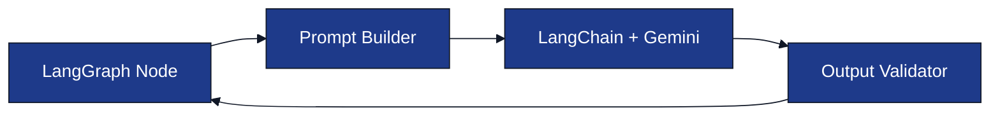

# Prompt Architecture

**Project:** AI Interview Service

**Document:** `docs/tech-spec/06_prompt_architecture.md`

**Version:** 1.0 (LOCKED)

---

# Ownership

**This document owns:**

- Prompt catalog.
- Prompt versioning.
- Prompt inputs and outputs.
- Prompt validation rules.
- Prompt retry strategy.

**References**

- `04_interview_engine.md` → LangGraph nodes that execute prompts.
- `05_resume_pipeline.md` → Resume Parser consumer.
- `03_folder_structure.md` → `internal/interview/engine/prompts/`.

---

# 1. Purpose

Every interaction with Gemini happens through a **versioned prompt** managed by the Interview Engine.

Prompts are responsible for **content generation only**. Workflow decisions always remain inside the Interview Engine.

---

# 2. Prompt Organization

All prompts live inside:

```text
internal/interview/engine/prompts/
│
├── builder.go
├── loader.go
├── registry.go
├── resume_parser_v1.txt
├── intent_detector_v1.txt
├── guardrail_detector_v1.txt
├── technical_evaluator_v1.txt
├── followup_generator_v1.txt
├── clarification_generator_v1.txt
├── hint_generator_v1.txt
├── thinking_prompt_v1.txt
├── topic_transition_v1.txt
├── behavioral_generator_v1.txt
└── final_evaluation_v1.txt
```

### Responsibilities

| File | Responsibility |
|------|----------------|
| `builder.go` | Builds runtime prompt context. |
| `loader.go` | Loads embedded prompt templates (`go:embed`). |
| `registry.go` | Maps prompt names to versions. |
| `*.txt` | Versioned prompt templates. |

---

# 3. Prompt Versioning

Each prompt is independently versioned.

| Prompt | Version |
|--------|---------|
| Resume Parser | `resume_parser_v1` |
| Intent Detector | `intent_detector_v1` |
| Guardrail Detector | `guardrail_detector_v1` |
| Technical Evaluator | `technical_evaluator_v1` |
| Follow-up Generator | `followup_generator_v1` |
| Clarification Generator | `clarification_generator_v1` |
| Hint Generator | `hint_generator_v1` |
| Thinking Prompt | `thinking_prompt_v1` |
| Topic Transition | `topic_transition_v1` |
| Behavioral Generator | `behavioral_generator_v1` |
| Final Evaluation | `final_evaluation_v1` |

New prompt behavior creates a new version (`v2`) instead of modifying `v1`.

---

# 4. Prompt Execution Flow



Every node executes exactly one prompt version.

---

# 5. Shared Prompt Context

The Prompt Builder injects runtime context before execution.

### Shared Context

| Context | Source |
|--------|--------|
| Current Question | Interview Engine |
| Candidate Message | WebSocket |
| Resume Context | Resume Intelligence |
| Candidate Memory | Redis |
| Current Topic | Interview Engine |
| Difficulty Level | Interview Engine |

Prompts remain stateless.

---

# 6. Prompt Catalog

| Prompt | Called By |
|--------|-----------|
| Resume Parser | Resume Pipeline |
| Intent Detector | `DetectCandidateIntent` |
| Guardrail Detector | `GuardrailCheck` |
| Technical Evaluator | `AnalyzeTechnicalAnswer` |
| Follow-up Generator | `GenerateFollowUp` |
| Clarification Generator | `GenerateClarification` |
| Hint Generator | `GenerateHint` |
| Thinking Prompt | `GenerateThinkingResponse` |
| Topic Transition | `TransitionTopic` |
| Behavioral Generator | `BehavioralDiscussion` |
| Final Evaluation | `GenerateFinalEvaluation` |

---

# 7. Resume Parser Prompt

### Purpose

Convert normalized resume text into structured resume JSON.

### Input

- Normalized resume text.

### Output

- Candidate details.
- Skills.
- Projects.
- Experience.
- Education.

Used only by the Resume Pipeline.

---

# 8. Intent Detector Prompt

### Purpose

Classify the candidate's latest message.

### Output

| Field | Description |
|------|-------------|
| `intent` | Candidate intent. |
| `confidence` | Confidence score (0–1). |

### Allowed Intents

- `ANSWER`
- `REQUEST_CLARIFICATION`
- `ASK_HINT`
- `THINKING_OUT_LOUD`
- `OFF_TOPIC`
- `PROMPT_INJECTION`
- `END_REQUEST`

---

# 9. Guardrail Detector Prompt

### Purpose

Detect unsupported or malicious candidate messages.

### Output

| Field | Description |
|------|-------------|
| `is_safe` | Safe to continue interview. |
| `category` | Detection category. |

### Categories

- `NORMAL`
- `OFF_TOPIC`
- `PROMPT_INJECTION`
- `UNSUPPORTED`

---

# 10. Technical Evaluator Prompt

### Purpose

Evaluate one technical answer for the active topic.

### Output

| Field | Description |
|------|-------------|
| `technical_score` | Technical correctness. |
| `depth_score` | Concept depth. |
| `reasoning_score` | Practical reasoning. |
| `communication_score` | Communication quality. |
| `strengths` | Correct concepts. |
| `weaknesses` | Missing or incorrect concepts. |
| `follow_up_required` | Whether another question is needed. |

The Interview Engine consumes this output.

---

# 11. Conversation Prompts

These prompts generate interviewer responses without changing workflow state.

| Prompt | Purpose |
|--------|---------|
| Clarification | Rephrase current question. |
| Hint | Give directional hint only. |
| Thinking | Encourage reasoning. |
| Follow-up | Generate deeper question for current topic. |
| Topic Transition | Move naturally to next topic. |
| Behavioral | Generate resume-based behavioral question. |

Each prompt returns one structured response.

---

# 12. Final Evaluation Prompt

### Purpose

Generate the interview report after interview completion.

### Output

| Field | Description |
|------|-------------|
| `overall_score` | Final interview score. |
| `strengths` | Candidate strengths. |
| `weaknesses` | Candidate weaknesses. |
| `recommendation` | Hire recommendation. |
| `learning_recommendations` | Suggested improvement topics. |

---

# 13. Output Validation

Every prompt response is validated before the Interview Engine uses it.

### Validation Rules

| Validation | Action |
|-----------|--------|
| Invalid JSON | Retry once. |
| Missing required field | Retry once. |
| Invalid enum value | Reject response. |
| Empty response | Retry once. |

Workflow state is never updated with invalid prompt output.

---

# 14. Retry Strategy

Retries happen only for recoverable LLM failures.

| Failure | Retry |
|--------|-------|
| Invalid JSON | 1 |
| Empty response | 1 |
| Timeout | 1 |
| Schema validation failure | 1 |

If retry fails, Interview Engine returns a safe fallback response.

---

# 15. Prompt Design Rules

- One prompt performs one responsibility.
- Prompts return structured JSON only.
- Prompts never manage interview state.
- Prompts never access Redis or PostgreSQL directly.
- Prompt templates are immutable within the same version.

---

# 16. Related Documents

| Topic | Document |
|-------|----------|
| Interview Workflow | `04_interview_engine.md` |
| Resume Pipeline | `05_resume_pipeline.md` |
| Evaluation Model | `12_evaluation_engine.md` |